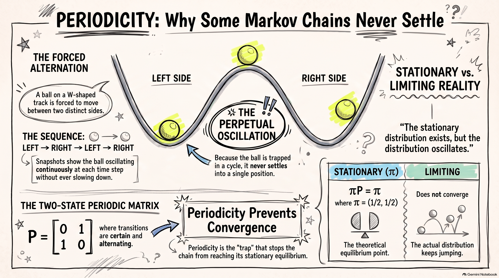

<!-- # Chapter 2: Discrete-Time Markov Chains -->

## Learning Outcomes {.unnumbered}

After studying this chapter, students should be able to:

1. **Define and describe** a discrete-time Markov chain and explain the Markov property.
2. **Construct and interpret** transition probabilities and transition matrices for discrete-time Markov chains.
3. **Calculate** $n$-step transition probabilities and state distributions using the Chapman–Kolmogorov equation and matrix methods.
4. **Calculate** joint and conditional probabilities for specified paths and events of a Markov chain.
5. **Analyse** Markov chains with absorbing or reflecting boundaries, including absorption probabilities and expected times to absorption.
6. **Analyse the long-run behaviour** of Markov chains using state classification, stationary distributions, and limiting distributions.


## Simple Random Walk: A Motivating Example

One of the simplest examples of a stochastic process is a **simple random walk**. It provides a natural starting point for studying discrete-time Markov chains because the distribution of the next state depends only on the current state.

Consider a simple model of the price of a stock, measured in baht. Suppose that, at the end of each trading day, the stock price either increases by 1 baht with probability $p$ or decreases by 1 baht with probability $q=1-p$. Let $X_n$ denote the stock price after $n$ trading days, with initial value

$$
X_0=a.
$$

Thus,

$$
X_n=X_{n-1}+Z_n,
$$

where the random change $Z_n$ is given by

$$
Z_n=
\begin{cases}
1, & \text{with probability }p,\\
-1, & \text{with probability }q=1-p.
\end{cases}
$$

Equivalently,

$$
X_n=a+\sum_{i=1}^n Z_i.
$$

This process is called a **simple random walk**.

The time index is discrete, $n=0,1,2,\ldots$, and the state space is also discrete. A realisation of the process is a sequence of values

$$
X_0,X_1,X_2,\ldots
$$

obtained from one particular sequence of random changes $Z_1,Z_2,\ldots$. Such a sequence is called a **sample path**.

For example, if $X_0=100$ and the successive changes are

$$
+1,\quad -1,\quad +1,\quad +1,\quad -1,
$$

then the corresponding sample path is

$$
100,\quad 101,\quad 100,\quad 101,\quad 102,\quad 101.
$$

Different sequences of random changes produce different sample paths. The random walk therefore describes a collection of possible paths rather than a single deterministic sequence.

### The random changes

The random variables $Z_1,Z_2,\ldots$ are assumed to be independent and identically distributed. In particular,

$$
\Pr(Z_i=1)=p,
\qquad
\Pr(Z_i=-1)=q=1-p.
$$

The expected value and variance of each random change are

$$
\begin{aligned}
\mu
&=\mathrm{E}[Z_i]\\
&=p-q\\
&=2p-1,
\end{aligned}
$$

and

$$
\begin{aligned}
\sigma^2
&=\mathrm{Var}(Z_i)\\
&=\mathrm{E}[Z_i^2]-{\mathrm{E}[Z_i]}^2\\
&=1-(p-q)^2\\
&=4pq.
\end{aligned}
$$

When $p=\frac12$, the upward and downward movements have equal probability. The random walk is then called a **symmetric random walk**. In this case,

$$
\mathrm{E}[Z_i]=0,
\qquad
\mathrm{Var}(Z_i)=1.
$$

### Behaviour of the random walk

Since

$$
X_n=a+\sum_{i=1}^n Z_i,
$$

the expectation of the process at time $n$ is

$$
\begin{aligned}
\mathrm{E}[X_n]
&=a+\sum_{i=1}^n\mathrm{E}[Z_i]\\
&=a+n(p-q).
\end{aligned}
$$

Similarly, since the $Z_i$ are independent,

$$
\begin{aligned}
\mathrm{Var}(X_n)
&=\mathrm{Var}\left(\sum_{i=1}^n Z_i\right)\\
&=\sum_{i=1}^n\mathrm{Var}(Z_i)\\
&=4npq.
\end{aligned}
$$

Thus,

$$
\boxed{
\mathrm{E}[X_n]=a+n(p-q),
\qquad
\mathrm{Var}(X_n)=4npq.
}
$$

In particular, for a symmetric random walk,

$$
\mathrm{E}[X_n]=a,
\qquad
\mathrm{Var}(X_n)=n.
$$

The variance increases with time, reflecting the increasing uncertainty about the position of the random walk.

### Example: A probability involving several time points

Suppose that $X_0=100$. Consider the probability

$$
\Pr(X_2=98,X_5=99\mid X_0=100).
$$

For $X_2=98$, the process must decrease on both of the first two steps. This has probability

$$
q^2.
$$

Starting from $X_2=98$, we need to reach $X_5=99$ after three further steps. The net change must therefore be $+1$. This requires two upward steps and one downward step. There are

$$
{3\choose2}=3
$$

possible orders for these three steps, and each has probability $p^2q$. Hence,

$$
\begin{aligned}
\Pr(X_2=98,X_5=99\mid X_0=100)
&=q^2{3\choose2}p^2q\\
&=3p^2q^3.
\end{aligned}
$$

This example illustrates an important feature of the random walk: probabilities concerning future states can be calculated by considering the sequence of random changes between the relevant time points.

### Simulating a Simple Random Walk

The random walk has many possible sample paths. Simulation provides a simple way to visualise these paths and to see how the behaviour of the process changes across different realisations.

For simplicity, consider a symmetric random walk with

$$
p=q=\frac12
$$

and initial value $X_0=0$. At each step, the process moves one unit upward or downward with equal probability.

A single realisation can be simulated by generating independent random variables

$$
Z_1,Z_2,\ldots,Z_n,
$$

where

$$
Z_i=
\begin{cases}
1, & \text{with probability }1/2,\\
-1, & \text{with probability }1/2.
\end{cases}
$$

The corresponding sample path is then obtained from

$$
X_n=\sum_{i=1}^n Z_i.
$$

#### Simulating one realisation

The following R code generates and plots one realisation of a symmetric random walk over 100 steps.

```{r}
set.seed(123)

n <- 100

Z <- sample(
  c(-1, 1),
  size = n,
  replace = TRUE
)

X <- c(0, cumsum(Z))

plot(
  0:n, X,
  type = "l",
  xlab = "Time, n",
  ylab = "X_n",
  main = "One Realisation of a Simple Random Walk"
)
```

The first value of `X` is $X_0=0$. The function `cumsum()` then calculates the cumulative sum of the successive changes, giving

$$
X_1,X_2,\ldots,X_n.
$$

The resulting graph is one possible sample path of the random walk. A different sequence of random changes produces a different path.

The use of `set.seed()` makes the simulation reproducible. In particular, another user running the same code with the same seed obtains the same realisation.

#### Simulating several realisations

A single sample path does not show the full range of possible behaviour. We can simulate several independent realisations and plot them together.

```{r}
set.seed(123)

n <- 100
m <- 10

X <- matrix(0, nrow = n + 1, ncol = m)

for (j in 1:m) {
  Z <- sample(
    c(-1, 1),
    size = n,
    replace = TRUE
  )

  X[, j] <- c(0, cumsum(Z))
}

matplot(
  0:n, X,
  type = "l",
  lty = 1,
  xlab = "Time, n",
  ylab = "X_n",
  main = "Ten Realisations of a Simple Random Walk"
)
```

Each line represents one realisation of the same stochastic process. All paths start at $X_0=0$, but they evolve differently because the random changes are different.

Some paths may move substantially above zero, while others may move below zero. Some may return to zero many times. This variation is a consequence of the randomness in the process.

The simulation also illustrates an important distinction:

* the **stochastic process** describes all possible random evolution of the system;
* a **realisation** or **sample path** is one particular outcome of that process.

Thus, the lines in the figure are not different stochastic processes. They are different realisations of the same simple random walk.

#### Changing the probability of an upward movement

The same simulation can be used when the probabilities of upward and downward movements are unequal. Suppose

$$
p=\Pr(Z_i=1)=0.6,
\qquad
q=\Pr(Z_i=-1)=0.4.
$$

The random walk now has a positive expected increment,

$$
\mathrm{E}[Z_i]=p-q=0.2.
$$

Consequently,

$$
\mathrm{E}[X_n]=0.2n
$$

when $X_0=0$. We can simulate several realisations as follows.

```{r}
set.seed(123)

n <- 100
m <- 10
p <- 0.6

X <- matrix(0, nrow = n + 1, ncol = m)

for (j in 1:m) {
  Z <- ifelse(
    runif(n) < p,
    1,
    -1
  )

  X[, j] <- c(0, cumsum(Z))
}

matplot(
  0:n, X,
  type = "l",
  lty = 1,
  xlab = "Time, n",
  ylab = "X_n",
  main = "Ten Realisations of a Simple Random Walk (p = 0.6)"
)
```

Compared with the symmetric case, the paths tend to move upward over time. This does not mean that every realisation increases at every step. A particular path can still move downward for several consecutive steps. The positive value of $\mathrm{E}[Z_i]$ describes the average direction of the process across repeated realisations.

Simulation therefore gives a useful visual interpretation of the quantities

$$
\mathrm{E}[X_n]
\quad\text{and}\quad
\mathrm{Var}(X_n),
$$

while the mathematical results describe these features exactly.


### Example: Distribution of the random walk

Suppose that $X_0=0$. After $n$ steps, let $A$ be the number of upward steps and $B$ the number of downward steps. Then

$$
A+B=n
$$

and

$$
X_n=A-B.
$$

For example, after $2n$ steps, the random walk can only be at an even integer. If

$$
X_{2n}=2m,
$$

then

$$
A-B=2m,
\qquad
A+B=2n.
$$

Solving these equations gives

$$
A=n+m,
\qquad
B=n-m.
$$

Since $A$ has a binomial distribution with parameters $2n$ and $p$,

$$
\Pr(X_{2n}=2m)
={2n\choose n+m}p^{n+m}q^{n-m},
\qquad -n\leq m\leq n.
$$

Similarly, after $2n+1$ steps, the random walk can only be at an odd integer. For $-n-1\leq m\leq n$,

$$
\Pr(X_{2n+1}=2m+1)
={2n+1\choose n+m+1}
p^{n+m+1}q^{n-m}.
$$

These results show that the distribution of the random walk can be obtained from the binomial distribution.

### A key observation

Consider the random walk at time $n$. Once the current value $X_n$ is known, the distribution of the next value $X_{n+1}$ is determined by

$$
\Pr(X_{n+1}=X_n+1\mid X_n)=p
$$

and

$$
\Pr(X_{n+1}=X_n-1\mid X_n)=q.
$$

The earlier values

$$
X_0,X_1,\ldots,X_{n-1}
$$

do not affect these probabilities once $X_n$ is known.

For example, suppose that $X_n=100$. Regardless of how the process arrived at 100, the probability that the next value is 101 is $p$, while the probability that the next value is 99 is $q$.

This property is the central idea behind a **Markov chain**. The random walk provides a simple example in which the future behaviour of the process depends on the present state, while the past is irrelevant once the present state is known. We formalise this idea in the next section.


## The Markov Property

Consider again the simple random walk model for the stock price. Suppose that the stock prices over the first four days are

$$
(X_0,X_1,X_2,X_3)=(100,99,98,99).
$$

We want to determine the distribution of the stock price $X_4$.

For the simple random walk, the price changes by $1$ with probability $p$ and by $-1$ with probability $q=1-p$. Since $X_3=99$,

$$
\Pr(X_4=100\mid X_3=99)=p
$$

and

$$
\Pr(X_4=98\mid X_3=99)=q.
$$

The important point is that these probabilities do not depend on how the process arrived at $X_3=99$. In particular,

$$
\Pr(X_4=j\mid X_0=100,X_1=99,X_2=98,X_3=99)
=\Pr(X_4=j\mid X_3=99).
$$

Thus, once the current state $X_3$ is known, the earlier values $X_0,X_1,X_2$ provide no additional information about the distribution of the next state.

This property is the key idea behind a Markov chain.

::: {.callout-note}

## Key Idea

A stochastic process has the **Markov property** if, given its current state, the past does not provide additional information about its future evolution.
:::


### The Markov property

Let $\{X_n:n=0,1,2,\ldots\}$ be a discrete-time stochastic process. The process has the **Markov property** if, for every $n$,

$$
\Pr(X_{n+1}=j\mid X_0=i_0,\ldots,X_{n-1}=i_{n-1},X_n=i)
=\Pr(X_{n+1}=j\mid X_n=i),
$$

whenever the conditional probabilities are defined.

The left-hand side uses the entire history of the process up to time $n$. The right-hand side uses only the current state $X_n=i$.

The Markov property can therefore be expressed informally as

$$
\boxed{\text{past} \longrightarrow \text{current state} \longrightarrow \text{future}.}
$$

The current state contains all the information from the past that is relevant for predicting the next state.

The Markov property also extends to the whole future of the process. Given the current state $X_n$, the future

$$
X_{n+1},X_{n+2},\ldots
$$

is conditionally independent of the past

$$
X_0,X_1,\ldots,X_{n-1}.
$$

For example, for a set of possible future states,

$$
\begin{aligned}
&\Pr(X_{n+1}=i_{n+1},\ldots,X_{n+m}=i_{n+m}\mid X_0=i_0,\ldots,X_n=i_n)\\
&=
\Pr(X_{n+1}=i_{n+1},\ldots,X_{n+m}=i_{n+m}\mid X_n=i_n).
\end{aligned}
$$

This means that once $X_n$ is known, the particular path taken to reach $X_n$ does not affect the conditional distribution of the future.

::: {#exm-walk}

## Simple random walk

The simple random walk has the Markov property.

Suppose that $X_n=i$. The next state can only be $i+1$ or $i-1$, with probabilities $p$ and $q=1-p$, respectively. Hence,

$$
\Pr(X_{n+1}=j\mid X_n=i)=
\begin{cases}
p, & j=i+1,\\
q, & j=i-1,\\
0, & \text{otherwise}.
\end{cases}
$$

These probabilities depend only on the current state $i$ and do not depend on the earlier states $X_0,\ldots,X_{n-1}$. Therefore, the simple random walk satisfies the Markov property.
:::

The Markov property does not mean that successive values of the process are independent. In fact, $X_{n+1}$ generally depends on $X_n$. The property states that, for predicting the future, the current state contains the information from the past that is relevant to the future.

## Discrete-Time Markov Chains

A **discrete-time Markov chain** is a discrete-time stochastic process that satisfies the Markov property.

Let

$$
\{X_n:n=0,1,2,\ldots\}
$$

be a stochastic process with state space $S$. The process is a **discrete-time Markov chain** if

$$
\boxed{
\Pr(X_{n+1}=j\mid X_n=i,X_{n-1}=i_{n-1},\ldots,X_0=i_0)
=\Pr(X_{n+1}=j\mid X_n=i)
}
$$

for every $n\geq 0$ and all states for which the conditional probabilities are defined.

The state space $S$ is the set of all possible values that the process can take. In many applications considered in this chapter, $S$ is finite or countably infinite. For example,

$$
S\subseteq{0,1,2,\ldots}.
$$

The simple random walk has state space

$$
S=\mathbb{Z}
$$

when there are no boundaries, because the process can take any integer value.

### Interpreting the definition

The Markov property can be understood by comparing two conditional probabilities.

Suppose that the current state is $i$. We can ask for the probability that the next state is $j$:

$$
\Pr(X_{n+1}=j\mid X_n=i).
$$

We could instead condition on the entire history,

$$
X_0=i_0,\ldots,X_{n-1}=i_{n-1},X_n=i.
$$

For a Markov chain, the answer is the same:

$$
\Pr(X_{n+1}=j\mid X_0=i_0,\ldots,X_n=i)
=\Pr(X_{n+1}=j\mid X_n=i).
$$

Thus, the complete history can be replaced by the current state when determining the distribution of the next state.

::: {.callout-note}

## Markov property

For a discrete-time Markov chain,

$$
\boxed{
\text{distribution of the next state}
=\text{a function of the current state only}.
}
$$

The process may depend on its past through the current state, but the past has no further effect once the current state is known.
:::

### Examples of Markov chains

The simple random walk is one example of a discrete-time Markov chain. Many actuarial models can also be formulated in this way.


For example, consider a no-claim discount (NCD) system. Let $X_n$ denote the discount level of a policyholder after $n$ policy years. Suppose the state space is

$$
S={0,1,2},
$$

where the states correspond to discount levels of $0%$, $20%$, and $40%$.

Suppose that a claim-free year moves the policyholder up one level, unless the maximum level has already been reached, while a year with at least one claim moves the policyholder down one level, unless the policyholder is already at level $0$.

If the probability of a claim-free year is $p$ and is independent of the policy year, then the probability of the next discount level depends only on the current discount level. For example, if $X_n=1$, then

$$
\Pr(X_{n+1}=0\mid X_n=1)=1-p
$$

and

$$
\Pr(X_{n+1}=2\mid X_n=1)=p.
$$

The previous discount levels $X_0,\ldots,X_{n-1}$ do not affect these probabilities once $X_n$ is known. Therefore, the NCD system is a discrete-time Markov chain.

The simple random walk and the NCD system have very different interpretations, but they share the same mathematical structure. In both cases, the current state is sufficient for determining the conditional distribution of the next state.

The next step is to describe these conditional probabilities systematically. This leads to the concept of **one-step transition probabilities** and their representation by a **transition probability matrix**.


{#fig-ncd-markov fig-align="center" width=85% .lightbox}


## One-Step Transition Probabilities and Transition Matrices

The Markov property tells us that, given the current state, the past does not provide additional information about the next state. We can therefore describe the one-step evolution of a Markov chain by specifying the probability of moving from each current state to each possible next state.

### One-step transition probabilities

Let $\{X_n:n=0,1,2,\ldots\}$ be a discrete-time Markov chain with state space $S$. The **one-step transition probability** from state $i$ to state $j$ at time $n$ is

$$
p_{ij}^{(n,n+1)}
=\Pr(X_{n+1}=j\mid X_n=i),
\qquad i,j\in S.
$$

The notation $p_{ij}^{(n,n+1)}$ indicates that the transition is from state $i$ at time $n$ to state $j$ at time $n+1$.

For a fixed current state $i$, the collection

$$
\left\{p_{ij}^{(n,n+1)}:j\in S\right\},
\qquad
p_{ij}^{(n,n+1)}
=
\Pr(X_{n+1}=j\mid X_n=i).
$$

describes the probability distribution of the next state given that the current state is $i$.

Therefore,

$$
0\leq p_{ij}^{(n,n+1)}\leq 1
$$

and

$$
\sum_{j\in S}p_{ij}^{(n,n+1)}=1.
$$

The probabilities in a given row must sum to one because the process must move to one of the states in $S$ at the next time point.

::: {.callout-note}

## Interpreting a transition probability

The quantity

$$
p_{ij}^{(n,n+1)}
=\Pr(X_{n+1}=j\mid X_n=i)
$$

is the probability that the chain moves **from state $i$ to state $j$ in one time step**.

The first subscript is the current state and the second subscript is the next state.
:::

### Example: Simple random walk

Consider a simple random walk with

$$
\Pr(Z_n=1)=p,
\qquad
\Pr(Z_n=-1)=q=1-p.
$$

If $X_n=i$, then the next state is either $i+1$ or $i-1$. Hence,

$$
p_{ij}^{(n,n+1)}
=\begin{cases}
p, & j=i+1,\\
q, & j=i-1,\\
0, & \text{otherwise}.
\end{cases}
$$

For example,

$$
\Pr(X_{n+1}=6\mid X_n=5)=p
$$

and

$$
\Pr(X_{n+1}=4\mid X_n=5)=q.
$$

The probabilities do not depend on $n$ because the rules governing the random walk are the same at every time point.

This leads to the important special case of a **time-homogeneous Markov chain**.

## Time-Homogeneous Markov Chains

A Markov chain is **time-homogeneous** if the one-step transition probabilities do not depend on the time at which the transition occurs. That is,

$$
\Pr(X_{n+1}=j\mid X_n=i)
=\Pr(X_1=j\mid X_0=i)
$$

for all $n\geq 0$ and $i,j\in S$.

In this case, we write

$$
p_{ij}
=\Pr(X_{n+1}=j\mid X_n=i).
$$

The transition probability is therefore determined entirely by the current state $i$ and the next state $j$.

If the transition probabilities depend on $n$, the chain is called **time-inhomogeneous** or **non-homogeneous**.

Unless stated otherwise, we will assume that Markov chains are time-homogeneous.

::: {.callout-note}

## Homogeneous versus non-homogeneous

For a time-homogeneous Markov chain,

$$
\Pr(X_{n+1}=j\mid X_n=i)=p_{ij}
$$

is the same at every time $n$.

For a time-inhomogeneous Markov chain, the corresponding probability can change with time:

$$
\Pr(X_{n+1}=j\mid X_n=i)=p_{ij}^{(n,n+1)}.
$$
:::

### Transition probability matrix

For a time-homogeneous Markov chain, all one-step transition probabilities can be collected into a matrix.

The **transition probability matrix**, denoted by $P$, is the matrix whose $(i,j)$-th entry is

$$
p_{ij}=\Pr(X_{n+1}=j\mid X_n=i).
$$

Thus,

$$
P=(p_{ij})_{i,j\in S}.
$$

For a finite state space $S={1,2,\ldots,d}$,

$$
P=
\begin{pmatrix}
p_{11} & p_{12} & \cdots & p_{1d}\\
p_{21} & p_{22} & \cdots & p_{2d}\\
\vdots & \vdots & \ddots & \vdots\\
p_{d1} & p_{d2} & \cdots & p_{dd}
\end{pmatrix}.
$$

The rows correspond to the current state and the columns correspond to the next state.

For example, the entry $p_{23}$ is the probability of moving from state $2$ to state $3$ in one time step:

$$
p_{23}=\Pr(X_{n+1}=3\mid X_n=2).
$$

Since each row gives a probability distribution over the possible next states,

$$
p_{ij}\geq 0
$$

and

$$
\sum_{j\in S}p_{ij}=1
$$

for every $i\in S$.

A matrix satisfying these two properties is called a **stochastic matrix**.

::: {.callout-note}

## Transition matrix

For a time-homogeneous Markov chain,

$$
\boxed{
P=(p_{ij}),\qquad
p_{ij}=\Pr(X_{n+1}=j\mid X_n=i).
}
$$

Each row of $P$ describes the probability distribution of the next state given the current state.
:::

### Example: NCD system

Consider the NCD system introduced earlier, with state space

$$
S={0,1,2},
$$

where the states correspond to discount levels of $0%$, $20%$, and $40%$.

Suppose that the probability of a claim-free year is $p$ and the probability of at least one claim is $1-p$. The rules are:

* from state $0$, a claim-free year moves the policyholder to state $1$, while a claim keeps the policyholder in state $0$;
* from state $1$, a claim-free year moves the policyholder to state $2$, while a claim moves the policyholder to state $0$;
* from state $2$, a claim-free year keeps the policyholder in state $2$, while a claim moves the policyholder to state $1$.

The transition probabilities are therefore

$$
\begin{aligned}
p_{00}&=1-p, & p_{01}&=p, & p_{02}&=0,\\
p_{10}&=1-p, & p_{11}&=0, & p_{12}&=p,\\
p_{20}&=0, & p_{21}&=1-p, & p_{22}&=p.
\end{aligned}
$$

Hence, the transition matrix is

$$
P=
\begin{pmatrix}
1-p & p & 0\\
1-p & 0 & p\\
0 & 1-p & p
\end{pmatrix}.
$$

{#fig-ncd-matrix fig-align="center" width=85% .lightbox}


For example, the second row gives the probabilities of the next NCD level when the current level is $1$:

$$
\Pr(X_{n+1}=0\mid X_n=1)=1-p,
$$

$$
\Pr(X_{n+1}=1\mid X_n=1)=0,
$$

and

$$
\Pr(X_{n+1}=2\mid X_n=1)=p.
$$

The row sums to one:

$$
(1-p)+0+p=1.
$$

The transition matrix provides a compact representation of the rules governing the NCD system. Once the current state is known, the corresponding row of $P$ gives the probability distribution of the next state.

### Example: Health insurance model

Consider a health insurance system in which a policyholder is classified at the end of each day as Healthy, Sick, or Dead. Let

$$
S={H,S,D}.
$$

Suppose the transition probability matrix is

$$
P=
\begin{pmatrix}
p_{HH} & p_{HS} & p_{HD}\\
p_{SH} & p_{SS} & p_{SD}\\
0 & 0 & 1
\end{pmatrix}.
$$

{#fig-hsd-chain fig-align="center" width=85% .lightbox}


The entry

$$
p_{HS}
=\Pr(X_{n+1}=S\mid X_n=H)
$$

is the probability that a healthy policyholder becomes sick during the next day.

Similarly,

$$
p_{HD}
=\Pr(X_{n+1}=D\mid X_n=H)
$$

is the probability that a healthy policyholder dies during the next day.

The last row is

$$
(0,0,1),
$$

which means that once the process enters state $D$, it remains there. Thus, $D$ is an **absorbing state**.

We will return to absorbing states and their properties later in the chapter.

### Why the transition matrix is useful

The transition matrix gives a complete description of the one-step behaviour of a time-homogeneous Markov chain. For a finite state space, instead of specifying each conditional probability separately, we can work with the single matrix $P$.

For example, if the current state is known to be $i$, then the $i$-th row of $P$ gives

$$
\Pr(X_{n+1}=j\mid X_n=i),
\qquad j\in S.
$$

This matrix representation also allows us to study transitions over several time steps using matrix multiplication. The next section develops this idea through **$n$-step transition probabilities** and the **Chapman–Kolmogorov equation**.


## $n$-Step Transition Probabilities and the Chapman–Kolmogorov Equation

The transition matrix $P$ describes how a Markov chain moves from one state to another in **one time step**. In many applications, however, we are interested in what happens over several time steps.

For example, in the NCD system, we may want to know the probability that a policyholder currently at discount level $1$ will be at discount level $2$ three years from now. This is a three-step transition probability.

### $n$-step transition probabilities

Let $\{X_n:n=0,1,2,\ldots\}$ be a time-homogeneous Markov chain with state space $S$. The **$n$-step transition probability** from state $i$ to state $j$ is

$$
p_{ij}^{(n)}
=
\Pr(X_{m+n}=j\mid X_m=i).
$$

For a time-homogeneous Markov chain, this probability does not depend on the starting time $m$. Thus, we can equivalently write

$$
p_{ij}^{(n)}
=
\Pr(X_n=j\mid X_0=i).
$$

The superscript $(n)$ indicates the number of transitions, not a power of the probability $p_{ij}$.

In particular,

$$
p_{ij}^{(1)}
=
\Pr(X_{n+1}=j\mid X_n=i)
=
p_{ij}.
$$

Thus, the one-step transition probabilities are the special case $n=1$.

::: {.callout-note}
## Interpreting $n$-step transition probabilities

The quantity

$$
p_{ij}^{(n)}
=
\Pr(X_{m+n}=j\mid X_m=i)
$$

is the probability that the chain is in state $j$ **$n$ steps after starting in state $i$**.
:::

### From one step to two steps

Suppose that the chain starts in state $i$ and we want to calculate the probability that it is in state $j$ after two steps.

The chain must be in some state $k$ after the first step. Therefore, we consider all possible intermediate states $k\in S$.

For a particular intermediate state $k$,

$$
\Pr(X_2=j\mid X_0=i,X_1=k)
=
\Pr(X_2=j\mid X_1=k)
=
p_{kj},
$$

by the Markov property.

Also,

$$
\Pr(X_1=k\mid X_0=i)=p_{ik}.
$$

Therefore,

$$
\begin{aligned}
\Pr(X_2=j\mid X_0=i)
&=
\sum_{k\in S}
\Pr(X_2=j,X_1=k\mid X_0=i)\\
&=
\sum_{k\in S}
\Pr(X_2=j\mid X_1=k,X_0=i)
\Pr(X_1=k\mid X_0=i)\\
&=
\sum_{k\in S}
p_{kj}p_{ik}.
\end{aligned}
$$

Hence,

$$
\boxed{
p_{ij}^{(2)}
=
\sum_{k\in S}p_{ik}p_{kj}.
}
$$

The two-step transition probability is therefore obtained by considering all possible intermediate states and adding the probabilities of the corresponding two-step paths.

### Example: NCD system

Consider the NCD system with transition matrix

$$
P=
\begin{pmatrix}
1-p & p & 0\\
1-p & 0 & p\\
0 & 1-p & p
\end{pmatrix}.
$$

Suppose that the policyholder is currently in state $1$. To find the probability of being in state $2$ two years later, there are two possible intermediate states.

The chain can move

$$
1\longrightarrow 0\longrightarrow 2
$$

or

$$
1\longrightarrow 2\longrightarrow 2.
$$

Therefore,

$$
\begin{aligned}
p_{12}^{(2)}
&=
p_{10}p_{02}+p_{12}p_{22}\\
&=
(1-p)(0)+p(p)\\
&=
p^2.
\end{aligned}
$$

Thus,

$$
\Pr(X_{n+2}=2\mid X_n=1)=p^2.
$$

This calculation illustrates the general principle: **to calculate a multi-step transition probability, consider all possible paths through the intermediate states.**

### The Chapman–Kolmogorov Equation

The same argument can be extended to an arbitrary number of steps.

Suppose that the chain starts in state $i$ and we want to find the probability of reaching state $j$ after $n$ steps. Choose an intermediate time $l$, where

$$
0<l<n.
$$

At time $l$, the chain must be in some state $k\in S$. We can therefore divide the journey into two parts:

$$
i
\overset{l\text{ steps}}{\longrightarrow}
k
\overset{n-l\text{ steps}}{\longrightarrow}
j.
$$

For a particular intermediate state $k$,

$$
\Pr(X_l=k\mid X_0=i)=p_{ik}^{(l)}
$$

and, by the Markov property,

$$
\Pr(X_n=j\mid X_l=k,X_0=i)
=
\Pr(X_n=j\mid X_l=k)
=
p_{kj}^{(n-l)}.
$$

Summing over all possible intermediate states gives

$$
\boxed{
p_{ij}^{(n)}
=
\sum_{k\in S}
p_{ik}^{(l)}p_{kj}^{(n-l)},
\qquad 0<l<n.
}
$$

This is the **Chapman–Kolmogorov equation**.

{#fig-ck-decomposition fig-align="center" width=85% .lightbox}


### Derivation

Starting from the definition of the $n$-step transition probability,

$$
p_{ij}^{(n)}
=
\Pr(X_n=j\mid X_0=i),
$$

we partition the event according to the state occupied at time $l$:

$$
\begin{aligned}
p_{ij}^{(n)}
&=
\sum_{k\in S}
\Pr(X_n=j,X_l=k\mid X_0=i)\\
&=
\sum_{k\in S}
\Pr(X_n=j\mid X_l=k,X_0=i)
\Pr(X_l=k\mid X_0=i)\\
&=
\sum_{k\in S}
\Pr(X_n=j\mid X_l=k)
\Pr(X_l=k\mid X_0=i)\\
&=
\sum_{k\in S}
p_{kj}^{(n-l)}p_{ik}^{(l)}.
\end{aligned}
$$

Hence,

$$
\boxed{
p_{ij}^{(n)}
=
\sum_{k\in S}
p_{ik}^{(l)}p_{kj}^{(n-l)}.
}
$$

The equation states that an $n$-step transition can be decomposed into an $l$-step transition followed by an $(n-l)$-step transition.

::: {.callout-note}
## Chapman–Kolmogorov equation

For a time-homogeneous Markov chain,

$$
\boxed{
p_{ij}^{(n)}
=
\sum_{k\in S}
p_{ik}^{(l)}p_{kj}^{(n-l)},
\qquad 0<l<n.
}
$$

The intermediate state $k$ is summed over all possible states of the chain at the intermediate time.
:::

### Matrix representation

The Chapman–Kolmogorov equation has a simple matrix interpretation.

Let

$$
P^{(n)}=(p_{ij}^{(n)})
$$

denote the matrix of $n$-step transition probabilities. The Chapman–Kolmogorov equation gives

$$
P^{(n)}
=
P^{(l)}P^{(n-l)}.
$$

For a time-homogeneous Markov chain,

$$
P^{(1)}=P.
$$

Consequently,

$$
P^{(2)}=P^2,
$$

$$
P^{(3)}=P^3,
$$

and, in general,

$$
\boxed{
P^{(n)}=P^n.
}
$$

Thus, the $(i,j)$-th entry of $P^n$ is the $n$-step transition probability:

$$
\boxed{
(P^n)_{ij}
=
p_{ij}^{(n)}
=
\Pr(X_{m+n}=j\mid X_m=i).
}
$$

This is one of the main reasons why transition matrices are useful. Multi-step probabilities can be calculated using ordinary matrix multiplication.


::: {#exm-ncd}

## NCD system: a three-year transition

Consider the NCD system with $p=3/4$, so that the transition matrix is

$$
P=
\begin{pmatrix}
1/4 & 3/4 & 0\\
1/4 & 0 & 3/4\\
0 & 1/4 & 3/4
\end{pmatrix}.
$$

Suppose that a policyholder is currently in state $1$. What is the probability that the policyholder will be in state $1$ three years later?

We first calculate

$$
P^3
=
\begin{pmatrix}
7/64 & 21/64 & 9/16\\
7/64 & 3/16 & 45/64\\
1/16 & 15/64 & 45/64
\end{pmatrix}.
$$

The required probability is the $(1,1)$ entry of $P^3$:

$$
\Pr(X_{n+3}=1\mid X_n=1)
=
p_{11}^{(3)}
=
(P^3)_{11}
=
\frac{3}{16}.
$$

Thus, the probability of returning to discount level $1$ after three years, given that the current level is $1$, is

$$
\boxed{\frac{3}{16}}.
$$
:::

### A path interpretation

The matrix calculation above combines the probabilities of all possible three-step paths from state $1$ to state $1$.

For example, one possible path is

$$
1\longrightarrow 0\longrightarrow 1\longrightarrow 1.
$$

Its probability is

$$
p_{10}p_{01}p_{11}.
$$

Another possible path is

$$
1\longrightarrow 2\longrightarrow 1\longrightarrow 1,
$$

with probability

$$
p_{12}p_{21}p_{11}.
$$

The entry $(P^3)_{11}$ adds the probabilities of all possible three-step paths that start at state $1$ and finish at state $1$.

This gives a useful interpretation of matrix multiplication in Markov chains:

$$
\boxed{
\text{matrix multiplication}
\quad\longleftrightarrow\quad
\text{summing probabilities over intermediate states}.
}
$$

## Distribution after $n$ steps

The transition matrix describes conditional probabilities given the current state. We can also use it to determine the **unconditional distribution** of the process.

Let the initial distribution of $X_0$ be

$$
\boldsymbol{\mu}^{(0)}
=
(\mu_0,\mu_1,\ldots),
$$

where

$$
\mu_i=\Pr(X_0=i).
$$

Let

$$
\boldsymbol{\mu}^{(n)}
=
(\mu_0^{(n)},\mu_1^{(n)},\ldots)
$$

denote the distribution of $X_n$, where

$$
\mu_j^{(n)}=\Pr(X_n=j).
$$

Using the law of total probability,

$$
\begin{aligned}
\Pr(X_{n+1}=j)
&=
\sum_{i\in S}
\Pr(X_{n+1}=j\mid X_n=i)\Pr(X_n=i)\\
&=
\sum_{i\in S}
p_{ij}\mu_i^{(n)}.
\end{aligned}
$$

In matrix notation,

$$
\boxed{
\boldsymbol{\mu}^{(n+1)}
=
\boldsymbol{\mu}^{(n)}P.
}
$$

Applying this relation repeatedly gives

$$
\boxed{
\boldsymbol{\mu}^{(n)}
=
\boldsymbol{\mu}^{(0)}P^n.
}
$$

Therefore, once the initial distribution and transition matrix are known, the distribution of the process at any future time can be calculated.

::: {.callout-note}
## Distribution of $X_n$

If

$$
\boldsymbol{\mu}^{(0)}
=
(\Pr(X_0=i))_{i\in S}
$$

is the initial distribution and $P$ is the transition matrix, then

$$
\boxed{
\boldsymbol{\mu}^{(n)}
=
\boldsymbol{\mu}^{(0)}P^n.
}
$$

The $j$-th component gives

$$
\Pr(X_n=j)
=
\left(\boldsymbol{\mu}^{(0)}P^n\right)_j.
$$
:::

The distinction between the two types of probabilities is useful:

| Quantity | Interpretation |
|:--|:--|
| $(P^n)_{ij}$ | Probability of being in state $j$ after $n$ steps, given that the chain starts in state $i$ |
| $(\boldsymbol{\mu}^{(0)}P^n)_j$ | Probability of being in state $j$ after $n$ steps, given an initial distribution $\boldsymbol{\mu}^{(0)}$ |

The first is a **conditional probability** based on a specified initial state. The second is an **unconditional probability** based on a probability distribution for the initial state.

::: {#exm-ncd-2}
## NCD system: distribution after three years

Suppose again that

$$
P=
\begin{pmatrix}
1/4 & 3/4 & 0\\
1/4 & 0 & 3/4\\
0 & 1/4 & 3/4
\end{pmatrix}
$$

and that the policyholder starts in state $1$ with probability one. Then

$$
\boldsymbol{\mu}^{(0)}
=
(0,1,0).
$$

After three years,

$$
\boldsymbol{\mu}^{(3)}
=
\boldsymbol{\mu}^{(0)}P^3.
$$

Since $\boldsymbol{\mu}^{(0)}$ selects the second row of $P^3$,

$$
\boldsymbol{\mu}^{(3)}
=
\left(
\frac{7}{64},
\frac{3}{16},
\frac{45}{64}
\right).
$$

Thus,

$$
\Pr(X_3=0)=\frac{7}{64},
$$

$$
\Pr(X_3=1)=\frac{3}{16},
$$

and

$$
\Pr(X_3=2)=\frac{45}{64}.
$$

As a check,

$$
\frac{7}{64}+\frac{3}{16}+\frac{45}{64}=1.
$$
:::

The transition matrix therefore allows us to move between three related levels of description:

$$
\boxed{
P
\quad\longrightarrow\quad
P^n
\quad\longrightarrow\quad
\boldsymbol{\mu}^{(0)}P^n.
}
$$

Here,

- $P$ describes one-step transitions;
- $P^n$ describes $n$-step transitions;
- $\boldsymbol{\mu}^{(0)}P^n$ gives the distribution of $X_n$.

These results provide the basic computational framework for discrete-time Markov chains. We can now use them to study more detailed questions about the joint behaviour of the process and, later, its long-run behaviour.


## Joint Distributions and Probabilities of Paths

The transition probabilities developed so far describe the state of a Markov chain at one future time. For example,

$$
p_{ij}^{(n)}
=
\Pr(X_{m+n}=j\mid X_m=i)
$$

gives the probability of reaching state $j$ after $n$ steps, given that the chain starts in state $i$.

In some applications, however, we are interested in the probability of observing a particular sequence of states. For example,

$$
\Pr(X_0=i_0,X_1=i_1,\ldots,X_n=i_n).
$$

Such a probability is a **joint probability** because it involves several random variables simultaneously.

The Markov property makes these probabilities particularly simple to calculate.

### Probability of a particular path

Let $\{X_n:n=0,1,2,\ldots\}$ be a time-homogeneous Markov chain with initial distribution

$$
\boldsymbol{\mu}
=
(\mu_i)_{i\in S},
\qquad
\mu_i=\Pr(X_0=i),
$$

and transition matrix $P=(p_{ij})$.

Consider a particular path

$$
i_0\longrightarrow i_1\longrightarrow\cdots\longrightarrow i_n.
$$

By the multiplication rule for conditional probabilities,

$$
\begin{aligned}
&\Pr(X_0=i_0,X_1=i_1,\ldots,X_n=i_n)\\
&=
\Pr(X_0=i_0)
\Pr(X_1=i_1\mid X_0=i_0)\\
&\qquad\times
\Pr(X_2=i_2\mid X_0=i_0,X_1=i_1)
\cdots\\
&\qquad\times
\Pr(X_n=i_n\mid X_0=i_0,\ldots,X_{n-1}=i_{n-1}).
\end{aligned}
$$

The Markov property allows each conditional probability after the first step to depend only on the state immediately before the transition. Therefore,

$$
\boxed{
\Pr(X_0=i_0,X_1=i_1,\ldots,X_n=i_n)
=
\mu_{i_0}
p_{i_0i_1}
p_{i_1i_2}
\cdots
p_{i_{n-1}i_n}.
}
$$

Thus, the probability of a particular path is the product of the initial probability and the transition probabilities along the path.

::: {.callout-note}
## Probability of a path

For a time-homogeneous Markov chain,

$$
\boxed{
\Pr(X_0=i_0,\ldots,X_n=i_n)
=
\mu_{i_0}
\prod_{r=0}^{n-1}p_{i_ri_{r+1}}.
}
$$

The formula applies to a specific sequence of states. If several paths satisfy an event of interest, their probabilities must be added.
:::

::: {#exm-3}
## A path in the NCD system

Consider the NCD system with states

$$
S=\{0,1,2\}
$$

and transition matrix

$$
P=
\begin{pmatrix}
1/4 & 3/4 & 0\\
1/4 & 0 & 3/4\\
0 & 1/4 & 3/4
\end{pmatrix}.
$$

Suppose the initial distribution is

$$
\boldsymbol{\mu}=(0.5,0.3,0.2).
$$

Find the probability of the path

$$
X_0=2,\qquad X_1=1,\qquad X_2=0.
$$
:::

The path is

$$
2\longrightarrow1\longrightarrow0.
$$

Therefore,

$$
\begin{aligned}
\Pr(X_0=2,X_1=1,X_2=0)
&=
\mu_2p_{21}p_{10}\\
&=
0.2\left(\frac14\right)\left(\frac14\right)\\
&=
\frac{1}{80}.
\end{aligned}
$$

Hence,

$$
\boxed{
\Pr(X_0=2,X_1=1,X_2=0)=\frac{1}{80}.
}
$$

The calculation does not require us to consider the entire transition matrix. We only need the initial probability of state $2$ and the transition probabilities along the specified path.

## Conditional probabilities of future paths

The same idea applies when the initial state is given.

Suppose that $X_n=i_n$ is known, and consider a particular future path

$$
i_n\longrightarrow i_{n+1}\longrightarrow\cdots\longrightarrow i_{n+m}.
$$

The Markov property gives

$$
\begin{aligned}
&\Pr(
X_{n+1}=i_{n+1},
\ldots,
X_{n+m}=i_{n+m}
\mid X_n=i_n)\\
&=
p_{i_ni_{n+1}}
p_{i_{n+1}i_{n+2}}
\cdots
p_{i_{n+m-1}i_{n+m}}.
\end{aligned}
$$

More generally, conditioning on the entire history up to time $n$ does not change this probability:

$$
\begin{aligned}
&\Pr(
X_{n+1}=i_{n+1},
\ldots,
X_{n+m}=i_{n+m}
\mid X_n=i_n,\ldots,X_0=i_0)\\
&=
\Pr(
X_{n+1}=i_{n+1},
\ldots,
X_{n+m}=i_{n+m}
\mid X_n=i_n).
\end{aligned}
$$

This is a direct consequence of the Markov property.

::: {#exm-ncd-4}

## A future path in the NCD system

Suppose the policyholder is currently in state $2$. Find the probability of the future path

$$
2\longrightarrow1\longrightarrow0.
$$

Using the transition matrix above,

$$
\begin{aligned}
&\Pr(X_{n+1}=1,X_{n+2}=0\mid X_n=2)\\
&=
p_{21}p_{10}\\
&=
\frac14\cdot\frac14\\
&=
\frac{1}{16}.
\end{aligned}
$$

Thus,

$$
\boxed{
\Pr(X_{n+1}=1,X_{n+2}=0\mid X_n=2)
=
\frac{1}{16}.
}
$$
:::

Notice that the initial distribution $\boldsymbol{\mu}$ is not needed because the current state is already specified.

## Paths with gaps between observation times

The path does not need to be observed at every time point.

Suppose that

$$
0\leq n_1<n_2<\cdots<n_k
$$

and that we want to calculate

$$
\Pr(X_{n_1}=i_1,\ldots,X_{n_k}=i_k).
$$

The first state, $X_{n_1}$, has distribution

$$
\Pr(X_{n_1}=i_1)
=
(\boldsymbol{\mu}P^{n_1})_{i_1}.
$$

After reaching $i_1$ at time $n_1$, the probability of reaching $i_2$ at time $n_2$ is

$$
p_{i_1i_2}^{(n_2-n_1)}
=
(P^{n_2-n_1})_{i_1i_2}.
$$

The same argument applies to each subsequent transition. Hence,

$$
\boxed{
\begin{aligned}
&\Pr(X_{n_1}=i_1,\ldots,X_{n_k}=i_k)\\
&=
(\boldsymbol{\mu}P^{n_1})_{i_1}
(P^{n_2-n_1})_{i_1i_2}
\cdots
(P^{n_k-n_{k-1}})_{i_{k-1}i_k}.
\end{aligned}
}
$$

This formula combines the two main results developed so far:

- $P^n$ gives transition probabilities over several time steps;
- the Markov property allows the path to be broken into successive transitions.

::: {.callout-note}
## Joint probabilities at selected times

For

$$
0\leq n_1<n_2<\cdots<n_k,
$$

the joint probability is

$$
\boxed{
\Pr(X_{n_1}=i_1,\ldots,X_{n_k}=i_k)
=
(\boldsymbol{\mu}P^{n_1})_{i_1}
\prod_{r=2}^{k}
(P^{n_r-n_{r-1}})_{i_{r-1}i_r}.
}
$$

Thus, the joint distribution of a Markov chain is determined by its initial distribution and its transition matrix.
:::

::: {#exm-weather}

## Weather model

Consider the weather model with states

$$
S=\{R,C,S\},
$$

where $R$, $C$, and $S$ denote rainy, cloudy, and sunny days. Suppose the transition matrix is

$$
P=
\begin{pmatrix}
0.7&0.2&0.1\\
0.75&0.15&0.1\\
0.2&0.4&0.4
\end{pmatrix}.
$$

Suppose that on Sunday the three weather states have equal probabilities:

$$
\boldsymbol{\mu}
=
\left(\frac13,\frac13,\frac13\right).
$$

Find the probability that it is sunny on Wednesday and Friday, and cloudy on Saturday.
:::

Wednesday is three days after Sunday, Friday is two days after Wednesday, and Saturday is one day after Friday. Therefore,

$$
\begin{aligned}
&\Pr(X_3=S,X_5=S,X_6=C)\\
&=
(\boldsymbol{\mu}P^3)_S
(P^2)_{SS}
P_{SC}.
\end{aligned}
$$

Using

$$
\boldsymbol{\mu}P^3
=
(0.631375,\;0.220625,\;0.148),
$$

together with

$$
(P^2)_{SS}=0.22
\qquad\text{and}\qquad
P_{SC}=0.4,
$$

we obtain

$$
\begin{aligned}
\Pr(X_3=S,X_5=S,X_6=C)
&=
0.148(0.22)(0.4)\\
&=
0.013024.
\end{aligned}
$$

Hence,

$$
\boxed{
\Pr(X_3=S,X_5=S,X_6=C)=0.013024.
}
$$

The important point is that we do not need to specify the weather on Thursday. The two-day transition probability

$$
(P^2)_{SS}
$$

automatically accounts for all possible weather states on Thursday.

## From specified paths to events

A joint probability may involve a specific path, such as

$$
\Pr(X_0=i_0,X_1=i_1,X_2=i_2),
$$

but many questions of interest concern an event that can occur through several different paths.

For example, suppose we want

$$
\Pr(X_2=j\mid X_0=i).
$$

There may be many possible states at time $1$. Therefore,

$$
\begin{aligned}
\Pr(X_2=j\mid X_0=i)
&=
\sum_{k\in S}
\Pr(X_2=j,X_1=k\mid X_0=i)\\
&=
\sum_{k\in S}
p_{ik}p_{kj}.
\end{aligned}
$$

This is precisely the two-step transition probability

$$
p_{ij}^{(2)}.
$$

Thus, the Chapman–Kolmogorov equation can be viewed as a way of **summing the probabilities of all paths that connect two states over a specified number of steps**.

This gives a useful connection between the results developed in this chapter:

$$
\boxed{
\begin{array}{c}
\text{Path probabilities}\\[2mm]
\downarrow\\
\text{Sum over intermediate states}\\[2mm]
\downarrow\\
\text{$n$-step transition probabilities}\\[2mm]
\downarrow\\
\text{Matrix powers }P^n
\end{array}
}
$$

The next section applies these ideas to a familiar process—the random walk—when its state space has absorbing or reflecting boundaries.


## Random Walks with Absorbing and Reflecting Barriers

The simple random walk introduced at the beginning of this chapter allows the process to move freely between neighbouring states. In many applications, however, the process is subject to **boundaries**.

For example, consider the fortune of a gambler. If the gambler's fortune reaches $0$, the gambler is ruined and the game ends. Similarly, suppose the game ends when the gambler reaches a target fortune $N$. The states $0$ and $N$ then act as boundaries that the process cannot leave.

Boundaries can also behave differently. A boundary may stop the process permanently, or it may force the process back into the interior of the state space.

These situations lead to two useful types of boundary behaviour:

- an **absorbing boundary**, where the process remains at the boundary once it reaches it;
- a **reflecting barrier**, where the process can move back into the state space after reaching the boundary.

The transition matrix provides a convenient way to describe both types of random walks.

### Random walk with absorbing barriers

Consider a random walk on the finite state space

$$
S=\{0,1,\ldots,N\}.
$$

Suppose that, for $i=1,\ldots,N-1$,

$$
\Pr(X_{n+1}=i+1\mid X_n=i)=p,
$$

and

$$
\Pr(X_{n+1}=i-1\mid X_n=i)=q,
$$

where

$$
p+q=1.
$$

Thus, when the process is in an interior state, it moves one step to the right with probability $p$ and one step to the left with probability $q$.

Now suppose that states $0$ and $N$ are absorbing. Once the process reaches either boundary, it remains there:

$$
p_{00}=1,
\qquad
p_{NN}=1.
$$

The transition matrix is therefore

$$
P=
\begin{pmatrix}
1 & 0 & 0 & 0 & \cdots & 0 & 0\\
q & 0 & p & 0 & \cdots & 0 & 0\\
0 & q & 0 & p & \cdots & 0 & 0\\
\vdots & & \ddots & \ddots & \ddots & & \vdots\\
0 & 0 & \cdots & q & 0 & p & 0\\
0 & 0 & \cdots & 0 & q & 0 & p\\
0 & 0 & \cdots & 0 & 0 & 0 & 1
\end{pmatrix}.
$$

The transition diagram has the form

$$
0
\longleftarrow
1
\longleftrightarrow
2
\longleftrightarrow
\cdots
\longleftrightarrow
N-1
\longrightarrow
N,
$$

with states $0$ and $N$ absorbing.

::: {.callout-note}
## Absorbing state

A state $i$ is called **absorbing** if

$$
p_{ii}=1.
$$

Once a Markov chain enters an absorbing state, it remains there forever.
:::

For the random walk above, both $0$ and $N$ are absorbing states. The states

$$
1,2,\ldots,N-1
$$

are the interior states.

This model is often called the **gambler's ruin model**. The state $X_n$ can represent the gambler's current fortune, with $0$ representing ruin and $N$ representing a target fortune at which the game stops.

::: {#exm-gambler-ruin}

## Gambler's ruin

A gambler starts with a fortune of $i$ units and plays a sequence of independent games. In each game, the gambler:

- wins one unit with probability $p$;
- loses one unit with probability $q=1-p$.

The gambler stops playing when the fortune reaches either $0$ or $N$.

Let $X_n$ denote the gambler's fortune after $n$ games.

1. What is the state space?
2. Which states are absorbing?
3. What is the probability of moving from state $i$ to state $j$ in one step?
:::

The state space is

$$
S=\{0,1,\ldots,N\}.
$$

States $0$ and $N$ are absorbing because

$$
p_{00}=p_{NN}=1.
$$

For an interior state $i$,

$$
p_{ij}
=
\begin{cases}
q, & j=i-1,\\
p, & j=i+1,\\
0, & \text{otherwise}.
\end{cases}
$$

Thus, the Markov chain has the same local movement as the simple random walk, but its behaviour changes when it reaches either boundary.

This example illustrates an important modelling idea: **the transition rules determine the behaviour of the process at the boundaries**.

### Reflecting barriers

A boundary does not always have to stop the process. In some applications, reaching a boundary means that the process is pushed back into the interior.

Consider a random walk on

$$
S=\{0,1,\ldots,N\}.
$$

Suppose that for the interior states,

$$
\Pr(X_{n+1}=i+1\mid X_n=i)=p,
$$

and

$$
\Pr(X_{n+1}=i-1\mid X_n=i)=q,
$$

where $p+q=1$.

At state $0$, suppose that

$$
\Pr(X_{n+1}=0\mid X_n=0)=\alpha
$$

and

$$
\Pr(X_{n+1}=1\mid X_n=0)=1-\alpha.
$$

The process therefore cannot move to state $-1$. Instead, it either remains at $0$ or moves back to state $1$.

In this case, state $0$ is called a **reflecting barrier**.

For example, if $\alpha=0$, then the process must move from $0$ to $1$ on the next step:

$$
p_{01}=1.
$$

If $0<\alpha<1$, the process may remain at the boundary for one or more periods before returning to the interior.

A similar construction can be used at the upper boundary $N$.

::: {.callout-note}
## Absorbing versus reflecting boundaries

The difference can be summarized as follows.

| Boundary type | Behaviour after reaching the boundary |
|---|---|
| Absorbing | The process remains at the boundary forever |
| Reflecting | The process can move back into the state space |

For an absorbing state $i$,

$$
p_{ii}=1.
$$

A reflecting barrier does not require $p_{ii}=1$; the process may leave the boundary on the next step.
:::

### A random walk with a reflecting lower barrier

Suppose the state space is

$$
S=\{0,1,2,\ldots\}
$$

and, for $i\geq1$,

$$
\Pr(X_{n+1}=i+1\mid X_n=i)=p,
$$

$$
\Pr(X_{n+1}=i-1\mid X_n=i)=q,
$$

where $p+q=1$.

At state $0$, suppose

$$
\Pr(X_{n+1}=0\mid X_n=0)=\alpha,
$$

and

$$
\Pr(X_{n+1}=1\mid X_n=0)=1-\alpha.
$$

The transition matrix has the form

$$
P=
\begin{pmatrix}
\alpha & 1-\alpha & 0 & 0 & \cdots\\
q & 0 & p & 0 & \cdots\\
0 & q & 0 & p & \cdots\\
0 & 0 & q & 0 & \ddots\\
\vdots & \vdots & \vdots & \ddots & \ddots
\end{pmatrix}.
$$

The first row differs from the rows corresponding to the interior states because the process cannot move from $0$ to $-1$.

This is a useful example of how a transition matrix can encode boundary conditions directly.

### Why boundary behaviour matters

The choice between absorbing and reflecting boundaries can lead to very different long-term behaviour.

With absorbing boundaries, the process eventually remains at a boundary once one is reached. For the gambler's ruin model,

$$
X_n\in\{0,N\}
$$

for all sufficiently large $n$, once an absorbing boundary has been reached.

With reflecting boundaries, the process can continue moving indefinitely. It may return to the boundary many times, but it is not permanently trapped there.

These differences lead to questions that we will study later in the chapter, such as:

- What is the probability that the chain is eventually absorbed at $N$?
- What is the probability that it is eventually absorbed at $0$?
- How long does it take, on average, to reach an absorbing state?
- What is the long-run distribution when the boundaries are reflecting?

For now, the main point is that these questions can be formulated using the same Markov-chain framework developed earlier.

::: {.callout-note}
## Key idea

A random walk with boundaries is still a Markov chain. The boundary conditions are incorporated into its transition probabilities and therefore into its transition matrix.

Once the transition matrix has been specified, the methods developed earlier—such as matrix powers, $n$-step transition probabilities, and state distributions—remain available.
:::


### Absorbing States and Closed Classes

In a random walk with an absorbing barrier, reaching the barrier means that the process remains there permanently. This is described using the concept of an **absorbing state**.

Recall that a state $i$ is called an **absorbing state** if

$$
p_{ii} = 1.
$$

Thus, once the process enters an absorbing state, it cannot leave. For example, in a random walk with absorbing barriers at $0$ and $N$,

$$
p_{00} = 1
\qquad\text{and}\qquad
p_{NN} = 1.
$$

Hence, both $0$ and $N$ are absorbing states.

More generally, a set of states can behave as a unit from which the process cannot escape. Such a set is called a **closed class**. A class $C$ is closed if, once the process enters $C$, it cannot move to any state outside $C$.

For the random walk above, the two absorbing states form two closed classes:

$$
C_1 = \{0\}
\qquad\text{and}\qquad
C_2 = \{N\}.
$$

The process must eventually enter one of these closed classes if it reaches either boundary. This leads to two natural questions:

1. What is the probability that the process is eventually absorbed at $0$ or at $N$?
2. What is the expected time until the process is absorbed?

These questions will be considered next.

The ideas of absorbing states and closed classes apply to general Markov chains, not only to random walks. Their general definitions and their relationship with other types of states will be introduced in the subsequent section on **classification of states**.

::: {.callout-note}
## Why are these questions important?

In applications, reaching an absorbing state often represents an important event, such as **ruin, failure, termination, or reaching a target**. Two quantities are therefore of particular interest:

1. the probability that the process is eventually absorbed at each possible absorbing state;
2. the expected time until absorption.

These quantities help us assess both the **likelihood** of an outcome and the **time until it occurs**.
:::

### Absorption Probabilities

Consider a random walk with absorbing barriers at $0$ and $N$. Suppose that the
process starts at $X_0=i$, where $i \in \{1,2,\ldots,N-1\}$. The process
eventually reaches one of the two absorbing states, $0$ or $N$.

Two probabilities are therefore of interest:

$$
u_i = \Pr(X_T = N \mid X_0 = i)
$$

and

$$
1-u_i = \Pr(X_T = 0 \mid X_0 = i),
$$

where

$$
T = \min\{n \ge 0 : X_n = 0 \text{ or } X_n = N\}
$$

is the time of absorption.

The probability $u_i$ depends on the initial state $i$. If the process starts
closer to $N$, we would generally expect a higher probability of reaching
$N$ before reaching $0$.

The boundary conditions are

$$
u_0 = 0
\qquad\text{and}\qquad
u_N = 1.
$$

The value of $u_i$ for an interior state can be found by considering the first
step of the random walk.

::: {#exm-fair-absorption-probability}
Consider a fair random walk with absorbing barriers at $0$ and $N$. At each
step, the process moves one unit to the right or one unit to the left with
probability $1/2$. Find the probability that the process is eventually
absorbed at $N$ when it starts at $i$, where
$i \in \{1,2,\ldots,N-1\}$.
:::

**Solution:**

Let

$$
u_i = \Pr(X_T = N \mid X_0 = i).
$$

The boundary conditions are

$$
u_0 = 0
\qquad\text{and}\qquad
u_N = 1.
$$

For an interior state $i$, the first step takes the process to either
$i+1$ or $i-1$. Therefore,

$$
u_i
=
\frac{1}{2}u_{i+1}
+
\frac{1}{2}u_{i-1},
\qquad i=1,2,\ldots,N-1.
$$

Rearranging gives

$$
u_{i+1}-u_i = u_i-u_{i-1}.
$$

Thus, the successive differences are constant, so $u_i$ is a linear
function of $i$. Write

$$
u_i = a+bi.
$$

Using the boundary conditions,

$$
u_0=a=0
$$

and

$$
u_N=a+bN=1.
$$

Hence,

$$
b=\frac{1}{N},
$$

and therefore

$$
\boxed{
u_i=\frac{i}{N}
}.
$$

Thus, for a fair random walk, the probability of reaching the upper
absorbing barrier is proportional to the starting position.

The probability of absorption at $0$ is therefore

$$
\Pr(X_T=0\mid X_0=i)
=
1-u_i
=
1-\frac{i}{N}
=
\frac{N-i}{N}.
$$

For example, if the process starts halfway between the two barriers, the
probability of reaching either barrier first is the same.


The result changes when the random walk is biased. Suppose that the process
moves one step to the right with probability $p$ and one step to the left
with probability $q=1-p$. Then the same first-step argument gives

$$
u_i
=
p u_{i+1}+q u_{i-1},
\qquad i=1,2,\ldots,N-1,
$$

with

$$
u_0=0
\qquad\text{and}\qquad
u_N=1.
$$

Solving this difference equation gives

$$
u_i =
\begin{cases}
\dfrac{i}{N}, & p=q=\dfrac{1}{2},\\
\\
\dfrac{1-(q/p)^i}{1-(q/p)^N}, & p\ne q.
\end{cases}
$$

::: {#exm-biased-absorption-probability}
Consider a random walk with absorbing barriers at $0$ and $10$. At each
step, the process moves one unit to the right with probability $p=0.6$ and
one unit to the left with probability $q=0.4$. If the process starts at
$X_0=4$, find the probability that it is eventually absorbed at $10$.
:::

**Solution:**

Since $p\ne q$,

$$
u_i
=
\frac{1-(q/p)^i}{1-(q/p)^N}.
$$

Here, $i=4$, $N=10$, and

$$
\frac{q}{p}=\frac{0.4}{0.6}=\frac{2}{3}.
$$

Therefore,

$$
u_4
=
\frac{1-(2/3)^4}{1-(2/3)^{10}}
\approx 0.817.
$$

Thus, the probability that the process eventually reaches the upper
absorbing barrier is approximately $0.884$.

The probability of absorption at $0$ is

$$
1-u_4\approx 0.183.
$$

The upward bias makes absorption at $10$ substantially more likely than it
would be for a fair random walk starting from the same state.

### Expected Time to Absorption

The absorption probabilities tell us where the random walk is likely to
end. Another natural question is how long it takes to reach one of the
absorbing barriers.

For a random walk with absorbing barriers at $0$ and $N$, define the
**time of absorption** by

$$
T = \min\{n \ge 0 : X_n = 0 \text{ or } X_n = N\}.
$$

If the process starts at $X_0=i$, where
$i \in \{1,2,\ldots,N-1\}$, the expected time to absorption is

$$
v_i = \mathrm{E}[T \mid X_0=i].
$$

The value of $v_i$ depends on the starting position. If the process starts
close to either absorbing barrier, we would generally expect absorption to
occur sooner than if it starts near the middle.

::: {.callout-note}
## Why is the expected time important?

In applications, knowing which outcome is likely to occur is often not
enough. We may also want to know how long it takes for the process to reach
that outcome. The expected time to absorption provides a measure of the
typical duration until an absorbing event occurs.
:::

::: {#exm-fair-expected-time-absorption}
Consider a fair random walk with absorbing barriers at $0$ and $N$. At each
step, the process moves one unit to the right or one unit to the left with
probability $1/2$. Find the expected time to absorption when the process
starts at $i$, where $i \in \{1,2,\ldots,N-1\}$.
:::

**Solution:**

Let

$$
v_i = \mathrm{E}[T \mid X_0=i].
$$

If the process starts at an absorbing state, the time to absorption is
zero. Hence,

$$
v_0=0
\qquad\text{and}\qquad
v_N=0.
$$

For an interior state $i$, the first step always takes one unit of time.
After that step, the process is either at $i+1$ or at $i-1$. Therefore,

$$
v_i
=
1+\frac{1}{2}v_{i+1}
+\frac{1}{2}v_{i-1},
\qquad i=1,2,\ldots,N-1.
$$

Rearranging gives

$$
v_{i+1}-2v_i+v_{i-1}=-2.
$$

The solution to this difference equation is

$$
v_i=-i^2+ai+b.
$$

Using the boundary conditions $v_0=0$ and $v_N=0$ gives

$$
b=0
$$

and

$$
-N^2+aN=0,
$$

so that

$$
a=N.
$$

Therefore,

$$
\boxed{
v_i=i(N-i)
}.
$$

Thus, for a fair random walk, the expected time to absorption is largest
when the process starts near the middle of the interval and decreases as
the starting point approaches either absorbing barrier.

For example, if $N=10$ and $X_0=4$, then

$$
\mathrm{E}[T\mid X_0=4]
=
4(10-4)
=
24.
$$


The expected time to absorption can also be found when the random walk is
biased. Suppose that the process moves one unit to the right with
probability $p$ and one unit to the left with probability $q=1-p$.

For an interior state $i$,

$$
v_i
=
1+pv_{i+1}+qv_{i-1},
\qquad i=1,2,\ldots,N-1,
$$

with

$$
v_0=0
\qquad\text{and}\qquad
v_N=0.
$$

For $p\ne q$, solving this difference equation gives

$$
v_i
=
\frac{
N\dfrac{1-(q/p)^i}{1-(q/p)^N}-i
}{
p-q
}.
$$

When $p=q=1/2$, this expression is replaced by the fair-random-walk
result

$$
v_i=i(N-i).
$$

::: {#exm-biased-expected-time-absorption}
Consider a random walk with absorbing barriers at $0$ and $10$. At each
step, the process moves one unit to the right with probability $p=0.6$ and
one unit to the left with probability $q=0.4$. If the process starts at
$X_0=4$, find the expected time to absorption.
:::

**Solution:**

Since $p\ne q$,

$$
v_i
=
\frac{
N\dfrac{1-(q/p)^i}{1-(q/p)^N}-i
}{
p-q
}.
$$

Here, $i=4$, $N=10$, and

$$
\frac{q}{p}=\frac{0.4}{0.6}=\frac{2}{3}.
$$

Therefore,

$$
v_4
=
\frac{
10\dfrac{1-(2/3)^4}{1-(2/3)^{10}}-4
}{
0.2
}
\approx 20.8.
$$

Thus, the expected time to absorption is approximately $20.8$ steps.

### First-Step Analysis

The calculations for absorption probabilities and expected times are
examples of a general method called **first-step analysis**.

The basic idea is simple: starting from a given state, consider all possible
states that can be reached after one transition. After this first transition,
the Markov property allows us to treat the process as a new process starting
from the state reached. This gives a system of equations for the quantities
of interest.

#### Absorption probabilities

Consider a Markov chain with an absorbing set $A$. Let

$$
u_i = \Pr(\text{the process is eventually absorbed in } A \mid X_0=i).
$$

For a state $i$ outside $A$, condition on the state reached after the first
transition. By the law of total probability and the Markov property,

$$
u_i
=
\sum_{j \in S} p_{ij}u_j.
$$

For an absorbing state in $A$,

$$
u_i=1,
$$

while for an absorbing state outside $A$,

$$
u_i=0.
$$

These boundary conditions, together with the first-step equations for the
remaining states, determine the absorption probabilities.

::: {#exm-first-step-absorption}
Consider the Markov chain with state space
$S=\{0,1,2\}$ and transition matrix

$$
P=
\begin{bmatrix}
1 & 0 & 0\\
p_{10} & p_{11} & p_{12}\\
0 & 0 & 1
\end{bmatrix}.
$$

States $0$ and $2$ are absorbing. Find the probability that the process is
eventually absorbed at state $0$, given that it starts at state $1$.
:::

**Solution:**

Let

$$
u_i=\Pr(X_T=0\mid X_0=i),
$$

where

$$
T=\min\{n\geq 0:X_n=0\text{ or }X_n=2\}.
$$

The boundary conditions are

$$
u_0=1
\qquad\text{and}\qquad
u_2=0.
$$

Starting from state $1$, the first transition can lead to states $0$, $1$,
or $2$. Therefore, first-step analysis gives

$$
u_1
=
p_{10}u_0+p_{11}u_1+p_{12}u_2.
$$

Using the boundary conditions,

$$
u_1
=
p_{10}+p_{11}u_1.
$$

Hence,

$$
u_1
=
\frac{p_{10}}{1-p_{11}}.
$$

Since the entries in row $1$ of $P$ sum to $1$,

$$
1-p_{11}=p_{10}+p_{12}.
$$

Therefore,

$$
\boxed{
u_1=\frac{p_{10}}{p_{10}+p_{12}}
}.
$$

Thus, the probability of eventual absorption at state $0$ depends on the
relative probabilities of leaving state $1$ towards the two absorbing
states.

#### Expected time to absorption

First-step analysis can also be used to find the expected time until
absorption.

Let

$$
v_i=\mathrm{E}[T\mid X_0=i],
$$

where $T$ is the time of absorption. If $i$ is an absorbing state, then

$$
v_i=0.
$$

For a non-absorbing state $i$, one transition occurs before the process can
be absorbed. After this first transition, the expected additional time
depends on the state reached. Therefore,

$$
v_i
=
1+\sum_{j\in S}p_{ij}v_j.
$$

The term $1$ accounts for the first transition.

For absorbing states, $v_i=0$, so only the non-absorbing states contribute
to the sum.

::: {#exm-first-step-expected-time}
*Consider the Markov chain with state space
$S=\{0,1,2\}$ and transition matrix*

$$
P=
\begin{bmatrix}
1 & 0 & 0\\
p_{10} & p_{11} & p_{12}\\
0 & 0 & 1
\end{bmatrix}.
$$

*States $0$ and $2$ are absorbing. Find the expected time to absorption when
the process starts at state $1$.*
:::

**Solution:**

Let

$$
v_i=\mathrm{E}[T\mid X_0=i],
$$

where

$$
T=\min\{n\geq 0:X_n=0\text{ or }X_n=2\}.
$$

Since states $0$ and $2$ are absorbing,

$$
v_0=0
\qquad\text{and}\qquad
v_2=0.
$$

Starting from state $1$, one transition occurs first. The process then
moves to state $0$, $1$, or $2$. Hence,

$$
v_1
=
1+p_{10}v_0+p_{11}v_1+p_{12}v_2.
$$

Using $v_0=v_2=0$,

$$
v_1=1+p_{11}v_1.
$$

Therefore,

$$
v_1=\frac{1}{1-p_{11}}.
$$

Thus,

$$
\boxed{
\mathrm{E}[T\mid X_0=1]
=
\frac{1}{1-p_{11}}
}.
$$

The result has a simple interpretation. The quantity $1-p_{11}$ is the
probability of leaving state $1$ on each step. A larger probability of
remaining in state $1$ therefore leads to a longer expected time to
absorption.

#### A system of first-step equations

When there are several non-absorbing states, first-step analysis produces a
system of simultaneous equations.

::: {#exm-first-step-system}
*Consider a Markov chain with state space
$S=\{0,1,2,3\}$ and transition matrix*

$$
P=
\begin{bmatrix}
1 & 0 & 0 & 0\\
p_{10} & p_{11} & p_{12} & p_{13}\\
p_{20} & p_{21} & p_{22} & p_{23}\\
0 & 0 & 0 & 1
\end{bmatrix}.
$$

*States $0$ and $3$ are absorbing. Let*

$$
T=\min\{n\geq 0:X_n=0\text{ or }X_n=3\}.
$$

*Find the equations satisfied by the probability of absorption at $0$ and
the expected time to absorption, starting from states $1$ and $2$.*
:::

**Solution:**

Let

$$
u_i=\Pr(X_T=0\mid X_0=i),
\qquad i=1,2.
$$

The boundary conditions are

$$
u_0=1
\qquad\text{and}\qquad
u_3=0.
$$

First-step analysis gives

$$
u_1
=
p_{10}+p_{11}u_1+p_{12}u_2,
$$

and

$$
u_2
=
p_{20}+p_{21}u_1+p_{22}u_2.
$$

Thus, the absorption probabilities are obtained by solving the system

$$
\begin{aligned}
u_1 &= p_{10}+p_{11}u_1+p_{12}u_2,\\
u_2 &= p_{20}+p_{21}u_1+p_{22}u_2.
\end{aligned}
$$

Now let

$$
v_i=\mathrm{E}[T\mid X_0=i],
\qquad i=1,2.
$$

Since $v_0=v_3=0$, first-step analysis gives

$$
v_1
=
1+p_{11}v_1+p_{12}v_2,
$$

and

$$
v_2
=
1+p_{21}v_1+p_{22}v_2.
$$

Hence, the expected times to absorption are obtained by solving

$$
\begin{aligned}
v_1 &= 1+p_{11}v_1+p_{12}v_2,\\
v_2 &= 1+p_{21}v_1+p_{22}v_2.
\end{aligned}
$$

The same approach applies whenever the quantity of interest after the
first transition can be expressed in terms of its value from the new
state.

First-step analysis therefore provides a systematic way to calculate
absorption probabilities, expected absorption times, and other quantities
associated with a Markov chain.


::: {.callout-note}
## A more compact formulation

When a Markov chain has several non-absorbing states, first-step analysis
leads to a system of simultaneous equations. For larger state spaces, these
systems can become lengthy.

Later, when we consider general Markov chains, we will express these
equations in **matrix form**. This provides a more compact way to organise
the calculations and makes it easier to solve systems involving many
states.
:::


### Simulation

Simulation provides a way to study the behaviour of a random walk by
generating sample paths from the model. For a random walk with absorbing
barriers, each simulated path starts from a specified state and continues
until it reaches one of the absorbing states.

Consider a random walk with absorbing barriers at $0$ and $N$. For each
simulated path:

1. Set the initial state to $X_0=i$.
2. Generate the next state according to the transition probabilities.
3. Continue until the process reaches $0$ or $N$.
4. Record the absorbing state and the time of absorption.

Repeating this procedure produces many independent sample paths. These
paths can be used to investigate both the probability of absorption at each
boundary and the distribution of the absorption time.

::: {#exm-simulating-absorbing-random-walk}
Consider a fair random walk with absorbing barriers at $0$ and $10$,
starting from $X_0=4$. Simulate several sample paths and record the
absorbing state and the time of absorption.
:::

**Solution:**

For a fair random walk, at each step we generate a move of $+1$ or $-1$,
each with probability $1/2$. The process stops when it reaches either $0$
or $10$.

A possible set of simulated paths is shown below. The particular results
will vary each time the simulation is performed.

| Path | Starting state | Absorbing state | Time of absorption |
|---:|---:|---:|---:|
| 1 | $4$ | $10$ | $18$ |
| 2 | $4$ | $0$ | $8$ |
| 3 | $4$ | $10$ | $30$ |
| 4 | $4$ | $0$ | $12$ |
| 5 | $4$ | $10$ | $24$ |

Each row corresponds to one simulated sample path. The absorbing state
shows where the path eventually ends, while the time of absorption records
how many transitions were required to reach that state.

The exact results derived earlier are

$$
\Pr(X_T=10\mid X_0=4)
=
\frac{4}{10}
=
0.4
$$

and

$$
\mathrm{E}[T\mid X_0=4]
=
4(10-4)
=
24.
$$

A small number of simulated paths will generally not reproduce these
values exactly. As the number of simulated paths increases, the simulated
results should become closer to the corresponding theoretical values.

Simulation also provides a visual way to understand the effect of the
starting position. Paths starting closer to an absorbing barrier tend to
reach that barrier sooner, while paths starting near the middle tend to
take longer to be absorbed.

::: {.callout-note}
## Simulation and exact results

Simulation does not replace the exact analysis when the required
probabilities and expectations can be calculated analytically. Instead, it
provides a way to visualise the process and to check whether simulated
results are consistent with the theoretical results.

For more complicated models, exact calculations may be difficult or
impossible. Simulation can then be used to estimate quantities of interest.
This idea leads to **Monte Carlo methods**.
:::


### Monte Carlo Methods

Simulation can be used to estimate quantities of interest by generating a
large number of independent sample paths. This approach is called a
**Monte Carlo method**.

Consider a random walk with absorbing barriers at $0$ and $N$, starting from
$X_0=i$. Suppose that $M$ independent sample paths are simulated, with
absorption times

$$
T_1,T_2,\ldots,T_M.
$$

For each path, we also record whether the process is eventually absorbed at
the upper barrier $N$.

#### Estimating an absorption probability

Let

$$
I_m =
\begin{cases}
1, & \text{if path }m\text{ is absorbed at }N,\\
0, & \text{if path }m\text{ is absorbed at }0.
\end{cases}
$$

The proportion of simulated paths absorbed at $N$ is

$$
\widehat{u}_i
=
\frac{1}{M}\sum_{m=1}^{M}I_m.
$$

This provides a Monte Carlo estimate of

$$
u_i
=
\Pr(X_T=N\mid X_0=i).
$$

As $M$ increases, $\widehat{u}_i$ will generally become closer to the
theoretical absorption probability $u_i$.

#### Estimating the expected time to absorption

The absorption time for the $m$th simulated path is $T_m$. The sample mean

$$
\widehat{v}_i
=
\frac{1}{M}\sum_{m=1}^{M}T_m
$$

provides a Monte Carlo estimate of

$$
v_i
=
\mathrm{E}[T\mid X_0=i].
$$

Thus, the same simulated paths can be used to estimate both the probability
of a particular absorbing outcome and the expected time until absorption.

::: {#exm-monte-carlo-absorption}
Consider a fair random walk with absorbing barriers at $0$ and $10$,
starting from $X_0=4$. Suppose that $M=1{,}000$ independent sample paths
are simulated. Of these paths, $397$ are absorbed at $10$. The total of the
$1{,}000$ absorption times is $23{,}850$. Estimate the probability of
absorption at $10$ and the expected time to absorption.
:::

**Solution:**

The estimated probability of absorption at $10$ is

$$
\widehat{u}_4
=
\frac{397}{1{,}000}
=
0.397.
$$

The estimated expected time to absorption is

$$
\widehat{v}_4
=
\frac{23{,}850}{1{,}000}
=
23.85.
$$

Therefore, the Monte Carlo estimates are

$$
\boxed{\widehat{u}_4=0.397}
$$

and

$$
\boxed{\widehat{v}_4=23.85}.
$$

For comparison, the exact results for a fair random walk are

$$
u_4=\frac{4}{10}=0.4
$$

and

$$
v_4=4(10-4)=24.
$$

The Monte Carlo estimates are close to the exact values. They would
generally become more stable as the number of simulated paths increases.

::: {.callout-note}
## Monte Carlo estimation

A Monte Carlo estimate is based on a finite number of simulated sample
paths, so it is subject to simulation error. Increasing the number of
simulated paths generally reduces this error, but it does not make the
estimate exactly equal to the theoretical value.

Monte Carlo methods are particularly useful when the quantity of interest
cannot be obtained easily by analytical methods.
:::

The random walk therefore provides a simple setting in which we can compare
three approaches:

- **Analytical calculation**, using results such as
  $u_i=i/N$ and $v_i=i(N-i)$ for the fair random walk;
- **Simulation**, by generating individual sample paths;
- **Monte Carlo estimation**, by using many simulated paths to estimate
  probabilities and expectations.
  
  


## Classification of States

So far, we have studied how a Markov chain moves from one state to another and how to calculate its $n$-step transition probabilities. We can now ask a different question: **what does the structure of the chain tell us about its long-term behaviour?**

Consider a Markov chain with several groups of states. Some states may lead to other states but cannot be reached again, while other groups of states may form a closed system from which the chain cannot escape. For example, in the five-state chain considered below, the chain may eventually enter either $\{1\}$ or $\{4,5\}$, and once it enters one of these sets, it cannot leave.

To analyse such behaviour, we need to identify which states can be reached from one another and which groups of states can be left. This leads to the classification of states into **communication classes**, **closed and non-closed classes**, and **transient and recurrent states**.


::: {.callout-note}

## Applications in Insurance

State classification is useful when a Markov chain models the evolution of an insurance system over time. For example:

* In an **NCD system**, communication between states helps determine whether policyholders can move between different premium levels and whether the system has a single long-run class.
* In a **health insurance model**, some health states may form a closed class, such as a death state, while other states may be transient because the policyholder can eventually leave them.
* In a **claims or risk model**, transient states can describe temporary conditions, while closed classes can describe long-term regimes from which the process cannot escape.

This classification helps us answer questions such as:

* Which states can the process eventually reach?
* Which states can be revisited indefinitely?
* Which states can be left permanently?
* Does the process eventually enter a particular closed class?
* What are the possible long-run outcomes of the insurance system?

These questions will lead naturally to the study of **absorption probabilities** and, later, the **long-run behaviour** of Markov chains.
:::

Throughout this section, $\{X_n\}_{n\geq 0}$ is a time-homogeneous Markov chain with state space $S$ and transition matrix $P=(p_{ij})$.

We begin with accessibility and communication.

### Accessibility and communication

For any $i,j\in S$, state $j$ is **accessible** from state $i$, denoted by

$$
i\rightarrow j,
$$

if

$$
p_{ij}^{(n)}>0
$$

for some $n\geq 0$. Thus, starting from $i$, there is a positive probability of reaching $j$ after some number of transitions.

Accessibility does not require $j$ to be reached in one step. For example, if there are states $k_1,\ldots,k_r$ such that

$$
p_{ik_1}p_{k_1k_2}\cdots p_{k_rj}>0,
$$

then $i\rightarrow j$.

Two states $i$ and $j$ **communicate**, denoted by

$$
i\leftrightarrow j,
$$

if

$$
i\rightarrow j
\quad\text{and}\quad
j\rightarrow i.
$$

Communication is an equivalence relation, so it partitions the state space into **communication classes**. Within a communication class, every pair of states communicates.

### Closed classes

A communication class $C$ is **closed** if, once the chain enters $C$, it cannot move to a state outside $C$. Equivalently,

$$
p_{ij}=0
\qquad
\text{for all }i\in C,\ j\notin C.
$$

A class that is not closed is called a **non-closed class**.

A closed class consisting of a single state is an **absorbing state**. Thus, state $i$ is absorbing if

$$
p_{ii}=1.
$$

If the entire state space consists of one communication class, then the Markov chain is **irreducible**. Otherwise, it is **reducible**.

::: {.callout-note}
## Irreducible Markov Chains

A Markov chain is **irreducible** if every state can be reached from every other state. Equivalently, the entire state space consists of a single communication class.

Thus, for every pair of states $i$ and $j$,

$$
i \leftrightarrow j.
$$

If the state space contains more than one communication class, the Markov chain is **reducible**.
:::

::: {.callout-note}
## Why Is Irreducibility Important?

Irreducibility means that the Markov chain can move between all states in the state space. No state or group of states is permanently separated from the others.

This matters for long-run behaviour. For a finite irreducible Markov chain, there is a unique stationary distribution, and every state is visited repeatedly in the long run.

Irreducibility therefore allows us to study the long-run behaviour of the **entire** Markov chain through a single stationary distribution.
:::

### Transient and recurrent states

A state is **recurrent** if, starting from that state, the chain returns to it with probability $1$. A state is **transient** if there is a positive probability that the chain never returns to it.

For a finite Markov chain, the classification can be determined from the communication classes:

* states in a closed communication class are recurrent;
* states in a non-closed communication class are transient.

Thus, for a finite Markov chain, a non-closed class describes states that the chain can eventually leave, while a closed class contains states that the chain cannot leave once it enters.


::: {.callout-note}

## Mathematical Definition

Let

$$
T_i=\min\{n\geq 1:X_n=i\}
$$

be the first return time to state $i$, given that $X_0=i$.

State $i$ is **recurrent** if

$$
\Pr(T_i<\infty\mid X_0=i)=1,
$$

and **transient** if

$$
\Pr(T_i<\infty\mid X_0=i)<1.
$$

Equivalently, a recurrent state is one that the chain returns to with probability $1$, whereas a transient state has a positive probability of never returning.

:::

::: {.callout-note}

## Key Idea

The communication structure tells us where the chain can move in the long run.

* A **closed class** cannot be left once entered.
* A **non-closed class** can be left.
* A **recurrent state** is returned to with probability $1$.
* A **transient state** has a positive probability of being left forever.
* In a finite Markov chain, states in closed classes are **recurrent**, while states in non-closed classes are **transient**.

Thus, the communication classes help us identify which states can be left permanently and which states the chain will revisit indefinitely.

:::


{width=80% fig-align="center"}


::: {#exm-five-state-classification}
Consider a Markov chain with state space $S=\{1,2,3,4,5\}$ and transition matrix

$$
P=
\begin{bmatrix}
1 & 0 & 0 & 0 & 0\\
1/5 & 1/5 & 1/5 & 1/5 & 1/5\\
1/3 & 1/3 & 0 & 1/3 & 0\\
0 & 0 & 0 & 0 & 1\\
0 & 0 & 0 & 1/2 & 1/2
\end{bmatrix}.
$$

Identify the communication classes. Which classes are closed? Classify the states as transient or recurrent. Is the Markov chain irreducible?

**Solution.**

The communication classes are

$$
C_1=\{1\},\qquad
C_2=\{2,3\},\qquad
C_3=\{4,5\}.
$$

The class $C_1=\{1\}$ is closed because

$$
p_{11}=1.
$$

The class $C_3=\{4,5\}$ is also closed. States $4$ and $5$ communicate because

$$
p_{45}>0
\quad\text{and}\quad
p_{54}>0,
$$

and neither state can move to a state outside $\{4,5\}$.

The class $C_2=\{2,3\}$ is non-closed. States $2$ and $3$ communicate, but the chain can leave this class. For example,

$$
p_{21}>0
$$

and

$$
p_{24}>0.
$$

Therefore,

$$
\boxed{\{1\}\text{ and }\{4,5\}\text{ are closed classes}}
$$

and

$$
\boxed{\{2,3\}\text{ is a non-closed class}.}
$$

Since the chain is finite, states $1,4,5$ are recurrent, while states $2,3$ are transient.

The chain is reducible because there is more than one communication class.
:::


::: {#exm-communication-classes}

Consider each of the following Markov chains:

1. the NCD system;  
2. the health insurance system; and
3. a simple random walk with absorbing boundaries.

Identify the communication classes. Is the Markov chain irreducible?

:::

**Solution.**

It is useful to draw the transition diagram and verify the answers from the transition probabilities.

**(a) NCD system**

Every pair of states communicates. Therefore, $\{0,1,2\}$ is a single communication class. Since it contains the entire state space, it is closed, and the Markov chain is **irreducible**.

For example,

$$
0 \to 1 \quad \text{and} \quad 1 \to 0,
$$

because $p_{01}>0$ and $p_{10}>0$. Similarly,

$$
1 \to 2 \quad \text{and} \quad 2 \to 1,
$$

because $p_{12}>0$ and $p_{21}>0$.

Hence, all three states communicate.

**(b) Health insurance system**

There are two communication classes:

$$
O=\{H,S\}, \qquad C=\{D\}.
$$

The class $O$ is non-closed, while $C$ is closed. Moreover, $D$ is an absorbing state since

$$
p_{DD}=1.
$$

The states $H$ and $S$ communicate because

$$
p_{HS}>0
\quad\text{and}\quad
p_{SH}>0.
$$

However, the class $O$ is not closed because $p_{HD}>0$. Once the chain reaches $D$, it cannot return to $H$ or $S$.

Therefore, the Markov chain is **reducible**.

**(c) Simple random walk with absorbing boundaries**

There are three communication classes:

$$
\{1,2,\ldots,N-1\}, \qquad \{0\}, \qquad \{N\}.
$$

The class $\{1,2,\ldots,N-1\}$ is non-closed, since the chain can move from an interior state to either boundary. The classes $\{0\}$ and $\{N\}$ are closed because $0$ and $N$ are absorbing states.

Since there is more than one communication class, the Markov chain is **reducible**.


## Absorption Probabilities in a General Markov Chain

The random walk with absorbing barriers showed how we can calculate the probability that a chain eventually reaches a particular absorbing state. We now extend this idea to a general finite Markov chain, where there may be several closed classes.

Suppose that $C$ is a closed communication class. Define

$$
u_i^C
=
\Pr(\text{the chain eventually enters }C\mid X_0=i).
$$

Thus, $u_i^C$ is the probability that the chain eventually enters the closed class $C$, given that it starts in state $i$.

If $i\in C$, then the chain is already in $C$ and cannot leave. Therefore,

$$
u_i^C=1,
\qquad i\in C.
$$

If $i$ belongs to another closed communication class, then the chain cannot move from that class to $C$. Hence,

$$
u_i^C=0.
$$

For a transient state $i$, the chain makes one transition to some state $j$ before eventually entering $C$. Conditioning on the state after this first transition gives

$$
u_i^C
=
\sum_{j\in S}p_{ij}u_j^C.
$$

This is the same first-step analysis used for the random walk, but it now applies to any finite Markov chain.

### Matrix formulation

Let

$$
\mathbf{u}^C
=
\begin{bmatrix}
u_1^C\\
u_2^C\\
\vdots\\
u_m^C
\end{bmatrix},
$$

where $m$ is the number of states. The first-step equations can be written compactly as

$$
\boxed{
\mathbf{u}^C=P\mathbf{u}^C
}
$$

together with the boundary conditions

$$
u_i^C=
\begin{cases}
1, & i\in C,\\
0, & i\in C',\quad C'\neq C,
\end{cases}
$$

for states in closed classes.

The remaining equations determine the absorption probabilities for the transient states.

::: {.callout-note}

## Key Idea

For a closed class $C$,

$$
u_i^C
=
\Pr(\text{eventually enter }C\mid X_0=i)
$$

measures the probability of each possible long-run destination.

The probabilities are found using **first-step analysis**:

$$
u_i^C=\sum_{j\in S}p_{ij}u_j^C.
$$

Thus, the classification of states tells us the possible closed classes, while the absorption probabilities tell us the probability of eventually entering each one.
:::

::: {#exm-general-absorption}
*Consider the five-state Markov chain from the previous section, with transition matrix*

$$
P=
\begin{bmatrix}
1 & 0 & 0 & 0 & 0\\
1/5 & 1/5 & 1/5 & 1/5 & 1/5\\
1/3 & 1/3 & 0 & 1/3 & 0\\
0 & 0 & 0 & 0 & 1\\
0 & 0 & 0 & 1/2 & 1/2
\end{bmatrix}.
$$

The closed classes are $C_1=\{1\}$ and $C_3=\{4,5\}$. Find the probability that the chain eventually enters $C_3$, given that it starts in state $2$.

**Solution.**

Define

$$
u_i
=
\Pr(\text{eventually enter }C_3\mid X_0=i).
$$

Since $C_3=\{4,5\}$ is closed,

$$
u_4=u_5=1.
$$

Since $C_1=\{1\}$ is another closed class,

$$
u_1=0.
$$

For states $2$ and $3$, first-step analysis gives

$$
u_2
=
\frac15u_1+\frac15u_2+\frac15u_3+\frac15u_4+\frac15u_5
$$

and

$$
u_3
=
\frac13u_1+\frac13u_2+\frac13u_4.
$$

Substituting the known values,

$$
u_2
=
\frac15u_2+\frac15u_3+\frac25
$$

and

$$
u_3
=
\frac13u_2+\frac13.
$$

Solving these equations gives

$$
u_2=\frac{7}{11},
\qquad
u_3=\frac{6}{11}.
$$

Therefore,

$$
\boxed{
\Pr(\text{eventually enter }\{4,5\}\mid X_0=2)
=
\frac{7}{11}
}
$$

There are two possible closed classes in this example. Thus, the probability of eventually entering $\{1\}$, starting from state $2$, is

$$
1-u_2=\frac{4}{11}.
$$

The two probabilities sum to $1$:

$$
\frac{7}{11}+\frac{4}{11}=1.
$$

Similarly, for a chain starting in state 3:

$$\boxed{ \Pr(\text{eventually enter }\{4,5\}\mid X_0=3) = \frac{6}{11} }$$ 

The probability of eventually entering $\{1\}$, starting from state $3$, is
$$1-u_3=\frac{5}{11}.$$ 
The two probabilities sum to $1$:
$$\frac{6}{11}+\frac{5}{11}=1.$$ 


:::


### Multiple closed classes

The previous example has two closed classes, $C_1=\{1\}$ and $C_3=\{4,5\}$. In general, suppose a finite Markov chain has closed classes

$$
C_1,C_2,\ldots,C_r.
$$

For each closed class $C_k$, define

$$
u_i^{(k)}
=
\Pr(\text{eventually enter }C_k\mid X_0=i).
$$

These probabilities describe the possible long-run destinations of the chain.

For a state $i$ that belongs to a closed class $C_k$,

$$
u_i^{(k)}=1,
$$

because the chain is already in $C_k$ and cannot leave it. For a state $i$ in another closed class $C_\ell$, where $\ell\neq k$,

$$
u_i^{(k)}=0.
$$

For transient states, the probabilities are obtained from the first-step equations

$$
u_i^{(k)}
=
\sum_{j\in S}p_{ij}u_j^{(k)}.
$$

Since the chain is finite, it eventually enters one of the closed classes with probability $1$. Therefore, for every state $i$,

$$
\boxed{
\sum_{k=1}^r u_i^{(k)}=1.
}
$$

For the five-state example,

$$
u_i^{(1)}
=
\Pr(\text{eventually enter }\{1\}\mid X_0=i)
$$

and

$$
u_i^{(3)}
=
\Pr(\text{eventually enter }\{4,5\}\mid X_0=i).
$$

Starting from state $2$, we found

$$
u_2^{(3)}=\frac{7}{11}.
$$

Hence,

$$
u_2^{(1)}
=
1-u_2^{(3)}
=
\frac{4}{11}.
$$

Thus, starting from state $2$, the chain eventually enters $\{1\}$ with probability $\frac{4}{11}$ and $\{4,5\}$ with probability $\frac{7}{11}$.

::: {.callout-note}

## Key Idea

For a finite Markov chain, the closed communication classes are the possible long-run destinations.

The quantity

$$
u_i^{(k)}
=
\Pr(\text{eventually enter }C_k\mid X_0=i)
$$

gives the probability of each destination when the chain starts from state $i$.

Therefore,

$$
\boxed{
\sum_{k=1}^r u_i^{(k)}=1.
}
$$

This extends the idea of absorption probabilities from a random walk with absorbing states to a general Markov chain with several closed classes.

:::

### From absorption to long-run behaviour

Absorption probabilities tell us **which closed class the chain eventually enters**. Once the chain enters a closed class, it remains there, but it can continue to move between the states within that class.

This leads to the next question:

> **What does the chain do in the long run after it enters a closed class?**

To answer this question, we need to study the **long-run behaviour of Markov chains**, including stationary distributions and limiting probabilities.


## Long-Run Behaviour of Markov Chains

In the previous section, we studied the structure of a Markov chain and identified its closed communication classes. For a finite Markov chain, the chain eventually enters one of these closed classes with probability $1$.

This leads to a natural question:

> **What happens after the chain enters a closed communicating class?**

The chain cannot leave the class, but it can continue to move between the states within the class. Over a long period of time, the probabilities of being in the different states may approach stable values.

For example, suppose a Markov chain models the no-claims discount level of a policyholder. After a sufficiently long period, the probability of finding a policyholder at each discount level may become approximately stable, even though the policyholder continues to move between levels from year to year.

We will use the term **long-run behaviour** to describe the behaviour of a Markov chain as $n\rightarrow\infty$. In particular, we will study:

* **stationary distributions**, which remain unchanged after each transition;
* **limiting distributions**, which describe the probabilities approached by the chain as $n\rightarrow\infty$;
* **periodicity**, which can prevent the distribution from converging even when a stationary distribution exists.

The key distinction is that a stationary distribution describes an equilibrium distribution, whereas a limiting distribution describes the distribution that the chain approaches over time. Under suitable conditions, these two distributions are the same.


### What happens within a closed communicating class?

Suppose that $C$ is a closed communicating class.

Once the Markov chain enters $C$, it cannot leave. However, the chain can continue to move between the states in $C$. Since every pair of states in $C$ communicates, each state can eventually be reached from every other state in the class.

Thus, a closed communicating class can be viewed as a self-contained part of the Markov chain:

$$
\text{enter }C
\quad\longrightarrow\quad
\text{remain in }C
\quad\longrightarrow\quad
\text{continue moving within }C.
$$

For a finite closed communicating class, there is a unique stationary probability distribution on that class. Denote it by

$$
\boldsymbol{\pi}
=
(\pi_i)_{i\in C}.
$$

It satisfies

$$
\boldsymbol{\pi}P_C=\boldsymbol{\pi},
$$

where $P_C$ is the transition matrix restricted to the states in $C$, together with

$$
\pi_i\geq 0,
\qquad
\sum_{i\in C}\pi_i=1.
$$

The stationary distribution has an important interpretation. If the chain starts with distribution $\boldsymbol{\pi}$, then its distribution remains $\boldsymbol{\pi}$ after every transition:

$$
\boldsymbol{\pi}P_C^n=\boldsymbol{\pi},
\qquad n\geq1.
$$

Thus, the stationary distribution describes a distribution that is in equilibrium with respect to the transition mechanism.

However, the existence of a stationary distribution does **not** by itself mean that the distribution of the chain will converge to it. Periodicity can prevent convergence. For example, a chain that alternates deterministically between two states has a stationary distribution $(1/2,1/2)$, but its distribution oscillates between the two states when it starts from a particular state.

This distinction leads to two separate questions:

1. **Does a stationary distribution exist?**
2. **Does the distribution of the chain converge to the stationary distribution?**

For a finite irreducible Markov chain, a stationary distribution exists and is unique. If the chain is also aperiodic, its distribution converges to this stationary distribution, regardless of its initial state.

::: {.callout-note}

## Key Idea

A **closed communicating class** cannot be left once it is entered.

Within a finite closed communicating class:

* the chain continues to move between states;
* there is a unique stationary distribution;
* if the class is also aperiodic, the distribution of the chain converges to this stationary distribution.

Thus, after identifying the closed classes, we can study the long-run behaviour within each class.

:::


<!-- ### Stationary distributions -->

<!-- Consider a Markov chain with transition matrix $P$ and state space $S$. A probability distribution -->

<!-- $$ -->
<!-- \boldsymbol{\pi}=(\pi_i)_{i\in S} -->
<!-- $$ -->

<!-- is called a **stationary distribution** if -->

<!-- $$ -->
<!-- \boxed{ -->
<!-- \boldsymbol{\pi}P=\boldsymbol{\pi}. -->
<!-- } -->
<!-- $$ -->

<!-- Equivalently, for each $j\in S$, -->

<!-- $$ -->
<!-- \pi_j -->
<!-- = -->
<!-- \sum_{i\in S}\pi_i p_{ij}. -->
<!-- $$ -->

<!-- The components of $\boldsymbol{\pi}$ must satisfy -->

<!-- $$ -->
<!-- \pi_i\geq0, -->
<!-- \qquad -->
<!-- \sum_{i\in S}\pi_i=1. -->
<!-- $$ -->

<!-- The equation -->

<!-- $$ -->
<!-- \boldsymbol{\pi}P=\boldsymbol{\pi} -->
<!-- $$ -->

<!-- means that if the distribution of $X_n$ is $\boldsymbol{\pi}$, then the distribution of $X_{n+1}$ is also $\boldsymbol{\pi}$. Therefore, -->

<!-- $$ -->
<!-- \boldsymbol{\pi}P^n=\boldsymbol{\pi}, -->
<!-- \qquad n\geq1. -->
<!-- $$ -->

<!-- A stationary distribution is therefore an **equilibrium distribution** of the Markov chain. -->

<!-- It is important to distinguish a stationary distribution from a limiting distribution. A stationary distribution can exist even when the distribution of the chain does not converge as $n\rightarrow\infty$. For example, a chain that alternates between two states has the stationary distribution -->

<!-- $$ -->
<!-- \boldsymbol{\pi} -->
<!-- = -->
<!-- \left(\frac12,\frac12\right), -->
<!-- $$ -->

<!-- but its distribution oscillates between the two states when it starts from one of them. -->

<!-- For a finite irreducible Markov chain, there is a unique stationary distribution. Whether the distribution of the chain converges to this stationary distribution depends on an additional condition, which we will introduce later. -->

<!-- ::: {.callout-note} -->

<!-- ## Key Idea -->

<!-- A stationary distribution is a probability distribution that is unchanged by the transition matrix: -->

<!-- $$ -->
<!-- \boxed{ -->
<!-- \boldsymbol{\pi}P=\boldsymbol{\pi}. -->
<!-- } -->
<!-- $$ -->

<!-- It describes an equilibrium distribution of the Markov chain. However, the existence of a stationary distribution does not by itself imply that the chain approaches this distribution over time. -->

<!-- ::: -->


### Stationary distributions

Consider a Markov chain with transition matrix $P$ and state space $S$. A probability distribution

$$
\boldsymbol{\pi}=(\pi_i)_{i\in S}
$$

is called a **stationary distribution** if

$$
\boxed{
\boldsymbol{\pi}P=\boldsymbol{\pi}.
}
$$

Equivalently, for each $j\in S$,

$$
\pi_j
=
\sum_{i\in S}\pi_i p_{ij}.
$$

The components of $\boldsymbol{\pi}$ must satisfy

$$
\pi_i\geq0,
\qquad
\sum_{i\in S}\pi_i=1.
$$

The equation $\boldsymbol{\pi}P=\boldsymbol{\pi}$ means that a chain with distribution $\boldsymbol{\pi}$ has the same distribution after one transition. Consequently,

$$
\boldsymbol{\pi}P^n=\boldsymbol{\pi},
\qquad n\geq1.
$$

Thus, a stationary distribution is an **equilibrium distribution** of the Markov chain.

For a finite irreducible Markov chain, there is a unique stationary distribution. We can find it by solving

$$
\boldsymbol{\pi}P=\boldsymbol{\pi}
$$

together with

$$
\sum_{i\in S}\pi_i=1.
$$

It is important to distinguish a stationary distribution from a limiting distribution. A stationary distribution may exist even when the distribution of the chain does not converge as $n\rightarrow\infty$. The additional condition required for convergence will be introduced later.

::: {.callout-note}

## Key Idea

A stationary distribution is a probability distribution that is unchanged by the transition matrix:

$$
\boxed{
\boldsymbol{\pi}P=\boldsymbol{\pi}.
}
$$

For a finite irreducible Markov chain, the stationary distribution is unique. Whether the distribution of the chain converges to it depends on additional properties of the chain.
:::

#### Worked example: Finding a stationary distribution

Consider the two-state Markov chain with transition matrix

$$
P=
\begin{bmatrix}
1-a & a\\
b & 1-b
\end{bmatrix},
\qquad 0<a,b<1.
$$

Let

$$
\boldsymbol{\pi}=(\pi_0,\pi_1)
$$

be its stationary distribution. We require

$$
\boldsymbol{\pi}P=\boldsymbol{\pi}.
$$

Therefore,

$$
(\pi_0,\pi_1)
\begin{bmatrix}
1-a & a\\
b & 1-b
\end{bmatrix}
=
(\pi_0,\pi_1).
$$

From the first component,

$$
\pi_0(1-a)+\pi_1b=\pi_0,
$$

which gives

$$
a\pi_0=b\pi_1.
$$

Together with the condition

$$
\pi_0+\pi_1=1,
$$

we obtain

$$
\pi_0=\frac{b}{a+b},
\qquad
\pi_1=\frac{a}{a+b}.
$$

Hence the stationary distribution is

$$
\boxed{
\boldsymbol{\pi}
=
\left(
\frac{b}{a+b},
\frac{a}{a+b}
\right).
}
$$

For example, if $a=0.2$ and $b=0.4$, then

$$
P=
\begin{bmatrix}
0.8&0.2\\
0.4&0.6
\end{bmatrix},
$$

and

$$
\boldsymbol{\pi}
=
\left(
\frac{0.4}{0.6},
\frac{0.2}{0.6}
\right)
=
\left(
\frac23,\frac13
\right).
$$

We can verify the result directly:

$$
\begin{aligned}
\boldsymbol{\pi}P
&=
\left(\frac23,\frac13\right)
\begin{bmatrix}
0.8&0.2\\
0.4&0.6
\end{bmatrix}\\
&=
\left(
\frac23,\frac13
\right).
\end{aligned}
$$

Thus, if the chain starts with distribution $\boldsymbol{\pi}=(2/3,1/3)$, its distribution remains $(2/3,1/3)$ after every transition.


<!-- ### Limiting distributions -->

<!-- A stationary distribution describes a distribution that remains unchanged under the transition mechanism. We now consider a different question: **does the distribution of the chain approach a stationary distribution as the number of transitions becomes large?** -->

<!-- For states $i,j\in S$, a **limiting distribution** $\boldsymbol{\pi}$ satisfies -->

<!-- $$ -->
<!-- \boxed{ -->
<!-- \lim_{n\rightarrow\infty} -->
<!-- \Pr(X_n=j\mid X_0=i) -->
<!-- = -->
<!-- \pi_j. -->
<!-- } -->
<!-- $$ -->

<!-- Thus, $\pi_j$ is the limiting probability of being in state $j$ after a large number of transitions, starting from state $i$. -->

<!-- If this limit is the same for every initial state $i$, then the long-run distribution does not depend on the starting state. -->

<!-- ### Conditions for convergence -->

<!-- The existence of a stationary distribution does not by itself guarantee convergence. Periodicity can cause the probabilities to oscillate indefinitely. -->

<!-- For example, consider the two-state chain -->

<!-- $$ -->
<!-- P= -->
<!-- \begin{bmatrix} -->
<!-- 0&1\\ -->
<!-- 1&0 -->
<!-- \end{bmatrix}. -->
<!-- $$ -->

<!-- Its stationary distribution is -->

<!-- $$ -->
<!-- \boldsymbol{\pi} -->
<!-- = -->
<!-- \left(\frac12,\frac12\right). -->
<!-- $$ -->

<!-- However, if $X_0=0$, then -->

<!-- $$ -->
<!-- \Pr(X_n=0\mid X_0=0) -->
<!-- = -->
<!-- \begin{cases} -->
<!-- 1, & n\text{ even},\\ -->
<!-- 0, & n\text{ odd}. -->
<!-- \end{cases} -->
<!-- $$ -->

<!-- Therefore, the distribution alternates between -->

<!-- $$ -->
<!-- (1,0) -->
<!-- \quad\text{and}\quad -->
<!-- (0,1), -->
<!-- $$ -->

<!-- and does not converge. -->

<!-- This example shows why **aperiodicity** is required for convergence. -->

<!-- For a finite irreducible Markov chain: -->

<!-- * irreducibility ensures that every state communicates with every other state; -->
<!-- * aperiodicity prevents the chain from being trapped in a regular cycle. -->

<!-- Together, these conditions imply convergence to the unique stationary distribution. -->


### Limiting distributions

A stationary distribution describes a probability distribution that remains unchanged under the transition mechanism. We now consider a different question:

> What happens to the distribution of the chain after a large number of transitions?

For states $i,j\in S$, suppose that

$$
\lim_{n\rightarrow\infty}
\Pr(X_n=j\mid X_0=i)
=
\pi_j.
$$

Then $\pi_j$ is the **limiting probability** of being in state $j$ when the chain starts from state $i$.

If the limit is the same for every initial state $i$, then the long-run probability of being in state $j$ does not depend on the starting state.

Thus, a limiting distribution is a probability distribution

$$
\boldsymbol{\pi}
=
(\pi_j)_{j\in S}
$$

such that

$$
\boxed{
\lim_{n\rightarrow\infty}p_{ij}^{(n)}
=
\pi_j
\qquad\text{for all }i,j\in S.
}
$$

The important feature of this result is that the limit depends on $j$, but not on the initial state $i$.

#### Limiting behaviour of the transition matrix

Recall that

$$
P^n
=
\begin{bmatrix}
p_{11}^{(n)} & p_{12}^{(n)} & \cdots\\
p_{21}^{(n)} & p_{22}^{(n)} & \cdots\\
\vdots & \vdots & \ddots
\end{bmatrix}.
$$

If

$$
p_{ij}^{(n)}\longrightarrow\pi_j
$$

for every $i,j$, then every row of $P^n$ approaches the same probability distribution:

$$
P^n
\longrightarrow
\begin{bmatrix}
\boldsymbol{\pi}\\
\boldsymbol{\pi}\\
\vdots\\
\boldsymbol{\pi}
\end{bmatrix}.
$$

For a finite state space, this can be written as

$$
\boxed{
P^n
\longrightarrow
\boldsymbol{1}\boldsymbol{\pi},
}
$$

where $\boldsymbol{1}$ is a column vector of ones.

This gives a useful interpretation of the entries of $P^n$. For large $n$, the $j$th entry of every row is approximately $\pi_j$, regardless of the state from which the chain started.

#### Limiting distribution from an initial distribution

The previous definition considers a particular initial state $X_0=i$. We can also start the chain with an arbitrary initial distribution

$$
\boldsymbol{\pi}^{(0)}
=
\left(
\Pr(X_0=i)
\right)_{i\in S}.
$$

After $n$ transitions, the distribution of $X_n$ is

$$
\boxed{
\boldsymbol{\pi}^{(n)}
=
\boldsymbol{\pi}^{(0)}P^n.
}
$$

Suppose that

$$
P^n
\longrightarrow
\boldsymbol{1}\boldsymbol{\pi}.
$$

Then

$$
\begin{aligned}
\boldsymbol{\pi}^{(n)}
&=
\boldsymbol{\pi}^{(0)}P^n\\
&\longrightarrow
\boldsymbol{\pi}^{(0)}
\boldsymbol{1}\boldsymbol{\pi}\\
&=
\boldsymbol{\pi},
\end{aligned}
$$

because

$$
\boldsymbol{\pi}^{(0)}\boldsymbol{1}=1.
$$

Therefore,

$$
\boxed{
\boldsymbol{\pi}^{(n)}
\longrightarrow
\boldsymbol{\pi}.
}
$$

The limiting distribution is therefore independent of the initial distribution.

#### Limiting and stationary distributions

There is a close relationship between limiting and stationary distributions.

Suppose that

$$
P^n\longrightarrow
\boldsymbol{1}\boldsymbol{\pi}.
$$

Since

$$
P^{n+1}=P^nP,
$$

taking limits gives

$$
\boldsymbol{1}\boldsymbol{\pi}
=
\boldsymbol{1}\boldsymbol{\pi}P.
$$

Hence,

$$
\boxed{
\boldsymbol{\pi}P=\boldsymbol{\pi}.
}
$$

Therefore, whenever a limiting distribution exists, it is a stationary distribution.

However, the converse is not necessarily true:

$$
\boxed{
\text{stationary distribution}
\;\not\Rightarrow\;
\text{limiting distribution}.
}
$$

A stationary distribution can exist even when the probabilities do not converge.

For example, consider

$$
P=
\begin{bmatrix}
0&1\\
1&0
\end{bmatrix}.
$$

The stationary distribution is

$$
\boldsymbol{\pi}
=
\left(\frac12,\frac12\right).
$$

However, if $X_0=0$, then

$$
\boldsymbol{\pi}^{(0)}=(1,0),
$$

and the distributions alternate:

$$
(1,0),
\quad
(0,1),
\quad
(1,0),
\quad
(0,1),
\quad\ldots
$$

Thus, $\boldsymbol{\pi}^{(n)}$ does not converge.

The reason is that this chain is periodic. We will study this condition in the next section.

#### Worked example: convergence to a limiting distribution

Consider the Markov chain with transition matrix

$$
P=
\begin{bmatrix}
1/3&2/3\\
2/3&1/3
\end{bmatrix}.
$$

Its stationary distribution is

$$
\boldsymbol{\pi}
=
\left(\frac12,\frac12\right).
$$

Suppose that the chain starts in state $0$. Then

$$
\boldsymbol{\pi}^{(0)}=(1,0).
$$

After one transition,

$$
\boldsymbol{\pi}^{(1)}
=
(1,0)P
=
\left(\frac13,\frac23\right).
$$

After two transitions,

$$
\boldsymbol{\pi}^{(2)}
=
\left(\frac13,\frac23\right)P
=
\left(\frac59,\frac49\right).
$$

After four transitions,

$$
\boldsymbol{\pi}^{(4)}
=
\boldsymbol{\pi}^{(0)}P^4
=
\left(\frac{41}{81},\frac{40}{81}\right).
$$

As $n$ increases, the distribution approaches

$$
\left(\frac12,\frac12\right).
$$

For example,

$$
\begin{aligned}
\boldsymbol{\pi}^{(8)}
&\approx
(0.5000762, 0.4999238),\\
\boldsymbol{\pi}^{(16)}
&\approx
(0.50000,0.50000).
\end{aligned}
$$

Thus,

$$
\boxed{
\boldsymbol{\pi}^{(n)}
\longrightarrow
\left(\frac12,\frac12\right).
}
$$

The same limiting distribution is obtained if the chain starts from state $1$, or from any other initial distribution.

This example illustrates the distinction between the two concepts:

$$
\begin{array}{c}
\text{Stationary distribution}\\[2mm]
\boldsymbol{\pi}P=\boldsymbol{\pi}
\end{array}
\qquad
\longrightarrow
\qquad
\begin{array}{c}
\text{Limiting distribution}\\[2mm]
\boldsymbol{\pi}^{(n)}\longrightarrow\boldsymbol{\pi}.
\end{array}
$$

The stationary distribution describes an equilibrium distribution. The limiting distribution describes the distribution approached by the chain as the number of transitions becomes large.

Whether a finite Markov chain has this convergence depends on its structural properties, particularly **irreducibility and aperiodicity**.


### Conditions for convergence

The existence of a stationary distribution does not by itself guarantee that the distribution of a Markov chain converges. For a finite irreducible chain, the additional condition required is **aperiodicity**.

#### Periodicity

A state $i$ is **periodic** if the chain can return to $i$ only at times that are multiples of some integer $d>1$. The period of state $i$ is

$$
d(i)
=
\gcd\left\{
n\geq1:p_{ii}^{(n)}>0
\right\}.
$$

If

$$
d(i)=1,
$$

then state $i$ is **aperiodic**.

For an irreducible Markov chain, all states have the same period. Therefore, we can describe the entire chain as periodic or aperiodic.

The key idea is whether the possible return times have a common factor greater than $1$.

For example, consider

$$
P=
\begin{bmatrix}
0&1\\
1&0
\end{bmatrix}.
$$

Starting from state $0$, the chain returns to state $0$ only after an even number of transitions:

$$
0\longrightarrow1\longrightarrow0
\longrightarrow1\longrightarrow0\longrightarrow\cdots
$$

Thus,

$$
p_{00}^{(n)}>0
\quad\text{only when }n=2,4,6,\ldots,
$$

so

$$
d(0)=\gcd\{2,4,6,\ldots\}=2.
$$

The chain is therefore periodic.

This periodicity causes the distribution to oscillate rather than converge.




#### How to check aperiodicity

In practice, it is usually unnecessary to calculate the period from the definition. Several simpler observations are useful.

**1. A self-loop implies aperiodicity.**

If

$$
p_{ii}>0,
$$

then

$$
p_{ii}^{(1)}>0.
$$

Therefore, $1$ is one of the possible return times, so

$$
d(i)=1.
$$

Hence, state $i$ is aperiodic.

For an irreducible chain, if one state has a self-loop, then every state is aperiodic. Thus, an irreducible chain with at least one state satisfying $p_{ii}>0$ is aperiodic.

::: {#exm-ncd-aperiodic .callout-example}
## Example: Aperiodicity in an NCD system

Consider an NCD system with four states, representing the policyholder's current discount level:

$$
\text{NCD 0},\quad \text{NCD 1},\quad \text{NCD 2},\quad \text{NCD 3}.
$$

Suppose that the transition matrix is

$$
P=
\begin{bmatrix}
0.80 & 0.20 & 0    & 0\\
0.10 & 0.80 & 0.10 & 0\\
0    & 0.10 & 0.80 & 0.10\\
0    & 0    & 0.20 & 0.80
\end{bmatrix}.
$$

The diagonal entries are all positive. For example,

$$
p_{22}=0.80>0.
$$

Thus, if a policyholder is currently in NCD 2, there is a positive probability of remaining in NCD 2 for one year. Hence,

$$
p_{22}^{(1)}>0,
$$

so the return time $1$ is possible and

$$
d(2)=1.
$$

The chain is irreducible because every NCD state can be reached from every other state. Therefore, once NCD 2 is known to be aperiodic, all four states are aperiodic.

Hence, this NCD system is **aperiodic**.

The self-loop has a simple interpretation: a policyholder can remain at the same NCD level from one year to the next. This breaks any fixed cycle in the possible return times.
:::

**2. Two return times with greatest common divisor $1$ imply aperiodicity.**

More generally, if there are two possible return times $m$ and $n$ such that

$$
p_{ii}^{(m)}>0,
\qquad
p_{ii}^{(n)}>0,
\qquad
\gcd(m,n)=1,
$$

then

$$
d(i)=1,
$$

so state $i$ is aperiodic.

For example, if returns to a state are possible after $2$ and $3$ transitions, then

$$
d(i)=\gcd(2,3)=1,
$$

so the state is aperiodic.

::: {#exm-aperiodicity-gcd .callout-example}
## Example: Two return times with greatest common divisor $1$

Suppose the states of the system are

$$
S=\{1,2,3,4\},
$$

with the transition matrix

$$
P=
\begin{bmatrix}
0 & 1 & 0 & 0\\
1/2 & 0 & 1/2 & 0\\
1/2 & 1/2 & 0 & 0\\
1/2 & 0 & 1/2 & 0
\end{bmatrix}.
$$

Consider state $2$. A return to state $2$ is possible after two transitions:

$$
2\longrightarrow 1\longrightarrow 2.
$$

It is also possible after three transitions:

$$
2\longrightarrow 3\longrightarrow 1\longrightarrow 2.
$$

Hence,

$$
p_{22}^{(2)}>0
\qquad\text{and}\qquad
p_{22}^{(3)}>0.
$$

Since

$$
\gcd(2,3)=1,
$$

the period of state $2$ is

$$
d(2)=1.
$$

Therefore, state $2$ is **aperiodic**.

Notice that state $2$ has no self-loop. Aperiodicity can arise from two possible return times whose greatest common divisor is $1$.
:::

**3. Alternating transitions often indicate period 2.**

If the states split into two groups and every transition moves from one group to the other, then a return to the original state requires an even number of transitions. Such a chain has period $2$.

For example,

$$
P=
\begin{bmatrix}
0&1\\
1&0
\end{bmatrix}
$$

has period $2$.

::: {#exm-period-two-alternating .callout-example}
## Example: Period $2$

Suppose the states of the system are

$$
S=\{1,2,3,4\},
$$

with transition matrix

$$
P=
\begin{bmatrix}
0 & 1/2 & 0 & 1/2\\
1/4 & 0 & 3/4 & 0\\
0 & 1/3 & 0 & 2/3\\
1/2 & 0 & 1/2 & 0
\end{bmatrix}.
$$

The states can be divided into two groups,

$$
\{1,3\}
\qquad\text{and}\qquad
\{2,4\}.
$$

Every transition moves from one group to the other:

$$
\{1,3\}\longrightarrow\{2,4\}
\longrightarrow\{1,3\}\longrightarrow\cdots
$$

Therefore, a return to any state is possible only after an even number of transitions. In particular,

$$
p_{ii}^{(2n)}>0,
\qquad
p_{ii}^{(2n+1)}=0,
\qquad n=1,2,\ldots
$$

for every $i\in S$.

Hence,

$$
d(i)=2
$$

for every state $i\in S$. Thus, all four states are **periodic with period $2$**.

This illustrates a common pattern: when a chain alternates between two groups of states, returns to the original state can occur only at even times, giving period $2$.
:::

#### Why aperiodicity matters

Suppose a finite irreducible chain is periodic. The chain may continue to move through its states indefinitely, but its probabilities can oscillate between different patterns. Consequently, the individual transition probabilities $p_{ij}^{(n)}$ may fail to converge.

Aperiodicity removes this regular oscillation. Therefore, for a finite irreducible aperiodic chain,

$$
p_{ij}^{(n)}
\longrightarrow
\pi_j,
\qquad n\rightarrow\infty,
$$

where $\boldsymbol{\pi}$ is the unique stationary distribution.

Thus, the three conditions in the convergence result have distinct roles:

* **Finite:** ensures the state space has finitely many states.
* **Irreducible:** ensures all states belong to one communicating class.
* **Aperiodic:** prevents persistent oscillation caused by periodic transitions.

Together, these conditions give convergence to a unique limiting distribution.


<!-- ### Limiting distribution from an initial distribution -->

<!-- Suppose the initial distribution of the chain is -->

<!-- $$ -->
<!-- \boldsymbol{\pi}^{(0)} -->
<!-- = -->
<!-- \left( -->
<!-- \Pr(X_0=i) -->
<!-- \right)_{i\in S}. -->
<!-- $$ -->

<!-- After $n$ transitions, the distribution is -->

<!-- $$ -->
<!-- \boxed{ -->
<!-- \boldsymbol{\pi}^{(n)} -->
<!-- = -->
<!-- \boldsymbol{\pi}^{(0)}P^n. -->
<!-- } -->
<!-- $$ -->

<!-- If the chain is finite, irreducible, and aperiodic, then -->

<!-- $$ -->
<!-- \boxed{ -->
<!-- \boldsymbol{\pi}^{(n)} -->
<!-- \longrightarrow -->
<!-- \boldsymbol{\pi} -->
<!-- \qquad\text{as }n\rightarrow\infty, -->
<!-- } -->
<!-- $$ -->

<!-- where $\boldsymbol{\pi}$ is the unique stationary distribution. -->

<!-- Thus, the limiting distribution is independent of the initial distribution. -->

<!-- ### Worked example -->

<!-- Consider the two-state Markov chain -->

<!-- $$ -->
<!-- P= -->
<!-- \begin{bmatrix} -->
<!-- 1/3&2/3\\ -->
<!-- 2/3&1/3 -->
<!-- \end{bmatrix}. -->
<!-- $$ -->

<!-- The chain is irreducible because each state can be reached from the other. It is also aperiodic because -->

<!-- $$ -->
<!-- p_{00}>0 -->
<!-- \quad\text{and}\quad -->
<!-- p_{11}>0. -->
<!-- $$ -->

<!-- The stationary distribution is obtained from -->

<!-- $$ -->
<!-- \boldsymbol{\pi}P=\boldsymbol{\pi}, -->
<!-- \qquad -->
<!-- \pi_0+\pi_1=1. -->
<!-- $$ -->

<!-- By symmetry, -->

<!-- $$ -->
<!-- \boldsymbol{\pi} -->
<!-- = -->
<!-- \left(\frac12,\frac12\right). -->
<!-- $$ -->

<!-- Suppose the chain starts in state $0$. Then -->

<!-- $$ -->
<!-- \boldsymbol{\pi}^{(0)} -->
<!-- = -->
<!-- (1,0). -->
<!-- $$ -->

<!-- After one transition, -->

<!-- $$ -->
<!-- \boldsymbol{\pi}^{(1)} -->
<!-- = -->
<!-- (1,0) -->
<!-- \begin{bmatrix} -->
<!-- 1/3&2/3\\ -->
<!-- 2/3&1/3 -->
<!-- \end{bmatrix} -->
<!-- = -->
<!-- \left(\frac13,\frac23\right). -->
<!-- $$ -->

<!-- After two transitions, -->

<!-- $$ -->
<!-- \boldsymbol{\pi}^{(2)} -->
<!-- = -->
<!-- \left(\frac13,\frac23\right) -->
<!-- \begin{bmatrix} -->
<!-- 1/3&2/3\\ -->
<!-- 2/3&1/3 -->
<!-- \end{bmatrix} -->
<!-- = -->
<!-- \left(\frac59,\frac49\right). -->
<!-- $$ -->

<!-- Continuing in this way, -->

<!-- $$ -->
<!-- \boldsymbol{\pi}^{(n)} -->
<!-- = -->
<!-- \boldsymbol{\pi}^{(0)}P^n -->
<!-- \longrightarrow -->
<!-- \left(\frac12,\frac12\right). -->
<!-- $$ -->

<!-- The same limiting distribution is obtained from any initial distribution. -->

<!-- ### Multiple closed classes -->

<!-- The situation is different when a finite Markov chain has more than one closed communicating class. -->

<!-- Suppose that the chain has closed classes -->

<!-- $$ -->
<!-- C_1,\ C_2,\ \ldots,\ C_r. -->
<!-- $$ -->

<!-- Once the chain enters one of these classes, it cannot leave. Therefore, the class eventually reached can depend on the initial state. -->

<!-- For example, suppose that $C_1$ and $C_2$ are two closed classes. If the chain starts from a state that can reach only $C_1$, then the long-run behaviour is determined by $C_1$. If it starts from another state that can reach only $C_2$, the long-run behaviour is determined by $C_2$. -->

<!-- Hence, there may be **no single limiting distribution that is independent of the initial state**. -->

<!-- Even when several closed classes are reachable from the same transient state, the limiting distribution can depend on the probabilities of entering the different classes. These probabilities can depend on the initial state. -->

<!-- This connects the long-run analysis to the absorption probabilities considered earlier. The absorption probabilities determine **which closed class is eventually reached**; the limiting behaviour within that class determines **how the chain behaves after entering it**. -->


### Multiple closed classes

The convergence result above assumes that the Markov chain is irreducible. It is useful to see what can happen when a finite chain has more than one closed communicating class.

Suppose that the chain has closed classes

$$
C_1,\ C_2,\ \ldots,\ C_r.
$$

Once the chain enters one of these classes, it cannot leave. Therefore, different starting states can lead to different closed classes.

For example, suppose that $C_1$ and $C_2$ are two closed classes. If the chain starts from a state that can reach only $C_1$, then its long-run behaviour is determined by $C_1$. If it starts from a state that can reach only $C_2$, its long-run behaviour is determined by $C_2$.

In this situation, there may be no single limiting distribution that is independent of the initial state.

Even when both $C_1$ and $C_2$ are reachable from the same transient state, the limiting distribution can depend on the initial state. Starting from different transient states can give different probabilities of eventually entering $C_1$ or $C_2$.

This connects the long-run analysis to the absorption probabilities considered earlier. The absorption probabilities determine **which closed class is eventually reached**. The limiting behaviour within that class determines **the distribution of the chain after a large number of transitions**.

Suppose, for example, that there are two closed classes, $C_1$ and $C_2$, and let

$$
u_i
=
\Pr(\text{eventually enter }C_1\mid X_0=i).
$$

Then

$$
1-u_i
$$

is the probability of eventually entering $C_2$.

If the limiting distributions within $C_1$ and $C_2$ are $\boldsymbol{\pi}^{(1)}$ and $\boldsymbol{\pi}^{(2)}$, respectively, then the long-run distribution starting from state $i$ is determined by these probabilities:

$$
u_i\boldsymbol{\pi}^{(1)}
+
(1-u_i)\boldsymbol{\pi}^{(2)}.
$$

Thus, the initial state can affect the long-run distribution through the probability of entering each closed class.

This explains why irreducibility is an important condition for a limiting distribution that is independent of the initial state. With a single communicating class, the chain does not have different closed classes between which its long-run behaviour can differ.


I would make this the **culminating theorem of the section**, bringing together stationary distributions, limiting distributions, irreducibility, and aperiodicity without repeating their earlier explanations.

### Main result

We can now combine the results on stationary distributions and limiting distributions.

::: {.callout-note}

## Theorem: Long-run behaviour of a finite irreducible aperiodic Markov chain

Consider a finite, irreducible, aperiodic, time-homogeneous Markov chain with state space $S$ and transition matrix $P$.

Then:

1. **There is a unique stationary distribution.**

   There is a unique probability distribution

   $$
   \boldsymbol{\pi}
   =
   (\pi_j)_{j\in S}
   $$

   satisfying

   $$
   \boxed{
   \boldsymbol{\pi}P=\boldsymbol{\pi}.
   }
   $$

2. **The transition probabilities converge.**

   For every pair of states $i,j\in S$,

   $$
   \boxed{
   \lim_{n\rightarrow\infty}p_{ij}^{(n)}
   =
   \pi_j.
   }
   $$

   Thus, the limiting probability of being in state $j$ is $\pi_j$, regardless of the initial state.

3. **The distribution converges for any initial distribution.**

   If the initial distribution is $\boldsymbol{\pi}^{(0)}$, then

   $$
   \boldsymbol{\pi}^{(n)}
   =
   \boldsymbol{\pi}^{(0)}P^n
   \longrightarrow
   \boldsymbol{\pi}.
   $$

   Hence, the long-run distribution does not depend on how the chain starts.

:::

The three conditions have different roles:

$$
\boxed{
\text{finite}
+
\text{irreducible}
+
\text{aperiodic}
}
$$

give the setting in which the chain has a unique stationary distribution and converges to it.

The result can be summarised as

$$
\boxed{
\boldsymbol{\pi}^{(0)}P^n
\longrightarrow
\boldsymbol{\pi}
\qquad\text{as }n\rightarrow\infty.
}
$$

Equivalently, the rows of $P^n$ converge to the same probability distribution:

$$
\boxed{
P^n
\longrightarrow
\begin{bmatrix}
\boldsymbol{\pi}\\
\boldsymbol{\pi}\\
\vdots\\
\boldsymbol{\pi}
\end{bmatrix}.
}
$$

Thus, after a sufficiently large number of transitions, the initial state has no effect on the distribution of the chain.

#### What if the conditions are not satisfied?

The assumptions in the theorem are important.

* If the chain is **periodic**, a stationary distribution may exist, but the transition probabilities may oscillate and fail to converge.
* If the chain is **reducible**, there may be several closed communicating classes, and the long-run distribution can depend on the initial state.
* If the state space is **infinite**, a stationary distribution need not exist even when the chain is irreducible.

These cases explain why the theorem requires all three conditions.

The next step is to interpret the limiting distribution in terms of the **long-run proportion of time spent in each state**.


### Application: Long-Run Behaviour of an NCD System {#application-long-run-ncd}

The long-run results for finite, irreducible and aperiodic Markov chains can be applied to a no-claims discount (NCD) system. The following example illustrates how the limiting distribution can be used to assess the long-run composition of an insurance portfolio and its premium income.

::: {.example}
Consider a no-claims discount system for motor insurance with three levels:

| Level    |  1 |   2 |   3 |
| :------- | -: | --: | --: |
| Discount | 0% | 30% | 50% |

The rules for moving between levels are:

* Following a claim-free year, move to the next higher level, or remain at level 3.
* Following a year with one claim, move to the next lower level, or remain at level 1.
* Following a year with two or more claims, move to level 1.

Suppose that the number of claims in a year is Poisson distributed. The portfolio consists of 10,000 policyholders:

* 5,000 are classified as good drivers, with the number of claims per year distributed as $\operatorname{Poisson}(0.1)$.
* 5,000 are classified as bad drivers, with the number of claims per year distributed as $\operatorname{Poisson}(0.2)$.

For each group:

1. Calculate $\Pr(N=0)$, $\Pr(N=1)$, and $\Pr(N\geq2)$.

2. Construct the transition probability matrix of the NCD system.

3. Find the stationary distribution and interpret it as the long-run distribution of policyholders across the three NCD levels.

4. Calculate the expected number of policyholders at each level once stability has been achieved.

5. Suppose the full premium before discount is $B$ per year. Calculate the expected premium income per driver once stability has been achieved.

6. Calculate the ratio of the expected premium income per driver for good drivers to that for bad drivers.

7. Comment on the results. In particular, discuss whether the NCD system provides a meaningful financial incentive for good driving.
:::

For a claim count $N\sim\operatorname{Poisson}(\lambda)$,

$$
\Pr(N=0)=e^{-\lambda},
\qquad
\Pr(N=1)=\lambda e^{-\lambda},
$$

and therefore

$$
\Pr(N\geq2)
=1-\Pr(N=0)-\Pr(N=1).
$$

If we write

$$
q_0=\Pr(N=0),\qquad
q_1=\Pr(N=1),\qquad
q_2=\Pr(N\geq2),
$$

the transition matrix is

$$
P=
\begin{bmatrix}
q_1+q_2 & q_0 & 0\\
1-q_0 & 0 & q_0\\
q_2 & q_1 & q_0
\end{bmatrix}.
$$

For example, from level 3, a claim-free year gives a move to level 3, one claim gives a move to level 2, and two or more claims give a move to level 1.

Once the stationary distribution

$$
\boldsymbol{\pi}=(\pi_1,\pi_2,\pi_3)
$$

has been found, the long-run expected number of policyholders at each level in a group of 5,000 drivers is

$$
5000\boldsymbol{\pi}
=
(5000\pi_1,5000\pi_2,5000\pi_3).
$$

If the full premium is $B$, the expected premium per driver is

$$
B\left(
\pi_1+0.70\pi_2+0.50\pi_3
\right).
$$

This application connects the mathematical result

$$
\boldsymbol{\pi}P=\boldsymbol{\pi}
$$

with an actuarial interpretation: **the stationary distribution gives the long-run proportions of policyholders at each NCD level, and these proportions determine long-run expected premium income.**

::: {.callout-note}

## Key Idea

A stationary distribution gives the long-run composition of the portfolio when the Markov chain is finite, irreducible and aperiodic. In an NCD system, it can therefore be used to assess the long-run distribution of policyholders across discount levels and the resulting premium income.
:::


  
