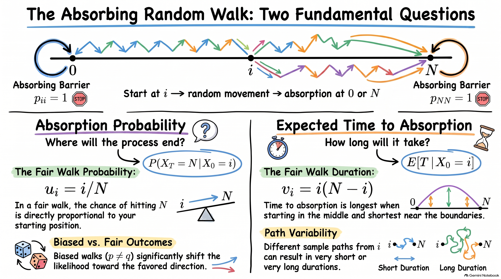
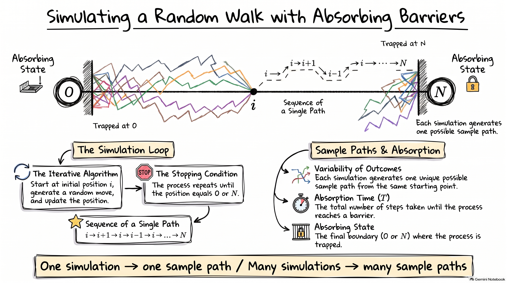
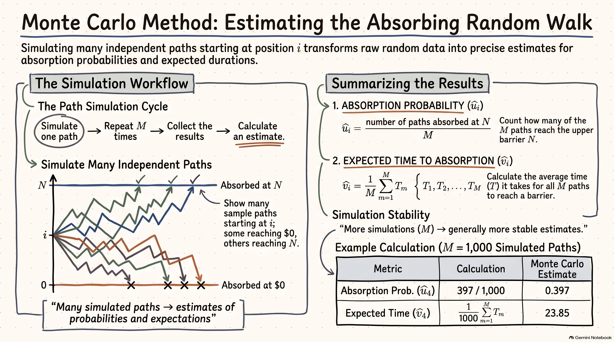

# Absorbing States and Closed Classes

## Absorbing states

In a random walk with an absorbing barrier, reaching the barrier means that the process remains there permanently.

A state $i$ is called an **absorbing state** if $p_{ii}=1$.

Thus, once the process enters state $i$, $\Pr(X_{n+1}=i\mid X_n=i)=1$, so the process cannot leave state $i$.

For a random walk with absorbing barriers at $0$ and $N$,

$$
p_{00}=1
\qquad\text{and}\qquad
p_{NN}=1.
$$

Hence, both $0$ and $N$ are absorbing states.

---

## Absorbing random walk

Consider the random walk on $S={0,1,\ldots,N}$ with absorbing barriers at $0$ and $N$.

For an interior state $i$,

$$
p_{i,i+1}=p,
\qquad
p_{i,i-1}=q=1-p.
$$

At the boundaries, $p_{00}=1$ and $p_{NN}=1$.

Thus, the process moves between neighbouring interior states until it
reaches either $0$ or $N$. Once it reaches a boundary, it remains there
forever.

The two boundary states are therefore **absorbing states**.

---

## Closed classes

An absorbing state is a simple example of a **closed class**.

A non-empty set of states $C$ is called a **closed class** if, once the
process enters $C$, it cannot move to a state outside $C$.

Equivalently,

$$
p_{ij}=0
\qquad
\text{for all }i\in C,\ j\notin C.
$$

Thus, a closed class is a set of states from which the process cannot escape.

---

## Absorbing states as closed classes

For the absorbing random walk, the sets

$$
C_1=\{0\}
\qquad\text{and}\qquad
C_2=\{N\}
$$

are closed classes.

For example, from state $0$,

$$
p_{00}=1
\qquad\text{and}\qquad
p_{0j}=0
\quad\text{for }j\ne0.
$$

Therefore, once the process reaches $0$, it remains in $C_1={0}$.

Similarly, once the process reaches $N$, it remains in
$C_2={N}$.

Thus, in this random walk, the two absorbing states form two separate
closed classes.

---

## Why closed classes matter

Closed classes describe parts of the state space from which the process
cannot escape.

For the absorbing random walk, once the process reaches either boundary,

$$
0
\qquad\text{or}\qquad
N,
$$

its future behaviour is completely determined: it remains at that state
forever.

This leads to two natural questions:

1. **Which absorbing state will the process reach?**
2. **How long will it take to reach an absorbing state?**

These correspond to the **absorption probability** and the **expected time
to absorption**, which we consider next.

---

## Key idea

An **absorbing state** is a state that cannot be left:

$$
p_{ii}=1.
$$

A **closed class** is a set of states that cannot be left once entered:

$$
p_{ij}=0
\qquad
\text{for }i\in C,\ j\notin C.
$$

Every absorbing state forms a closed class by itself.

For an absorbing random walk, the boundary states $0$ and $N$ are absorbing
states and therefore form two closed classes.

# Absorption Probabilities

## From where will the process end?

Consider a random walk with absorbing barriers at $0$ and $N$, starting at
$X_0=i$, where $i\in{1,2,\ldots,N-1}$.

The process eventually reaches one of the absorbing states, $0$ or $N$.

Two probabilities are therefore of interest:

$$
u_i=\Pr(X_T=N\mid X_0=i),
\qquad
1-u_i=\Pr(X_T=0\mid X_0=i),
$$

where $T=\min{n\geq0:X_n=0\text{ or }X_n=N}$ is the time of absorption.

The quantity $u_i$ is called the **absorption probability at $N$** when the
process starts from state $i$.

---

## Fundamental Questions in Random Walks

{fig-align="center" width="70%"}

---

## Boundary conditions

If the process starts at an absorbing state, the outcome is already known.

Therefore,

$$
u_0=0
\qquad\text{and}\qquad
u_N=1.
$$

For an interior state $i$, the value of $u_i$ depends on the possible first
steps.

If the process starts closer to $N$, we generally expect $u_i$ to be larger.

The absorption probability can therefore be found by considering the **first
step** of the random walk.

---

## Example: Fair random walk

Consider a fair random walk with absorbing barriers at $0$ and $N$. At each
step, the process moves one unit to the right or one unit to the left with
probability $1/2$. Find the probability that the process is eventually
absorbed at $N$ when it starts at $i$, where
$i\in{1,2,\ldots,N-1}$.

Let

$$
u_i=\Pr(X_T=N\mid X_0=i).
$$

The boundary conditions are $u_0=0$ and $u_N=1$.

For an interior state $i$, the first step gives

$$
u_i=\frac12u_{i+1}+\frac12u_{i-1},
\qquad i=1,2,\ldots,N-1.
$$

---

## Solving the Difference Equation

Rearranging the first-step equation gives

$$
u_{i+1}-u_i=u_i-u_{i-1}.
$$

Thus, the successive differences are constant, so $u_i$ is a linear
function of $i$. Write

$$
u_i=a+bi.
$$

Using $u_0=0$ and $u_N=1$,

$$
a=0,
\qquad
a+bN=1.
$$

Hence, $b=1/N$ and $\boxed{u_i=\frac{i}{N}}.$

---

## Absorption probabilities

Therefore,

$$
\boxed{\Pr(X_T=N\mid X_0=i)=\frac{i}{N}}.
$$

The probability of absorption at $0$ is

$$
\boxed{
\Pr(X_T=0\mid X_0=i)
=
1-\frac{i}{N}
=
\frac{N-i}{N}
}.
$$

---

## Interpretation

For a fair random walk, the probability of reaching the upper barrier is proportional to the starting position.

For example, if $N=10$ and $i=4$,

$$
\Pr(X_T=10\mid X_0=4)=\frac4{10}=0.4.
$$

The probability of reaching $0$ first is

$$
\Pr(X_T=0\mid X_0=4)=\frac6{10}=0.6.
$$

If the process starts halfway between the two barriers, the two absorbing
states are equally likely to be reached first.

---

## Biased random walk

Now suppose that the random walk moves one step to the right with
probability $p$ and one step to the left with probability $q=1-p$.

For an interior state, $u_i=pu_{i+1}+qu_{i-1}, \qquad i=1,2,\ldots,N-1,$

with boundary conditions $u_0=0 \qquad\text{and}\qquad u_N=1$.

Solving this difference equation gives

$$
\boxed{
u_i=
\begin{cases}
\dfrac{i}{N}, & p=q=\dfrac12,\\[6pt]
\dfrac{1-(q/p)^i}{1-(q/p)^N}, & p\ne q.
\end{cases}}
$$

The fair random walk is therefore a special case of the general result.

---

## Example: Biased Random Walk

Consider a random walk with absorbing barriers at $0$ and $10$. At each step,
the process moves one unit to the right with probability $p=0.6$ and one unit
to the left with probability $q=0.4$.

If the process starts at $X_0=4$, find the probability that it is eventually
absorbed at $10$.

Since $p\ne q$,

$$
u_i=\frac{1-(q/p)^i}{1-(q/p)^N}.
$$

Here, $i=4$, $N=10$, and

$$
\frac{q}{p}=\frac{0.4}{0.6}=\frac{2}{3}.
$$

---

## Example: Biased Random Walk

Therefore,

$$
u_4=
\frac{1-(2/3)^4}{1-(2/3)^{10}}
\approx0.817.
$$

Thus,

$$
\boxed{\Pr(X_T=10\mid X_0=4)\approx0.817}.
$$

The probability of absorption at $0$ is

$$
1-u_4\approx0.183.
$$

The upward bias makes absorption at $10$ more likely than absorption at $0$.

# Expected Time to Absorption

## How long until absorption?

The absorption probabilities tell us where the random walk is likely to end. We can also ask how long it takes to reach one of the absorbing barriers.

For a random walk with absorbing barriers at $0$ and $N$, define the **time of absorption** by

$$
T=\min\{n\geq0:X_n=0\text{ or }X_n=N\}.
$$

If the process starts at $X_0=i$, where $i\in{1,2,\ldots,N-1}$, define

$$
v_i=\mathrm{E}[T\mid X_0=i].
$$

The value of $v_i$ depends on the starting position. A process starting
close to an absorbing barrier will generally be absorbed sooner than one
starting near the middle.

---

## Why is the expected time important?

Knowing which outcome is likely to occur is often not enough. We may also want
to know how long it takes for the process to reach that outcome.

The expected time to absorption provides a measure of the average duration
until an absorbing event occurs.

For example, in an actuarial model, absorption might represent **ruin,
failure, or termination**. We may therefore want to know both

* the probability of the absorbing outcome; and
* the expected time until that outcome occurs.

---

## Example: Fair random walk

Consider a fair random walk with absorbing barriers at $0$ and $N$. At each
step, the process moves one unit to the right or one unit to the left with
probability $1/2$.

Find the expected time to absorption when the process starts at
$i$, where $i\in{1,2,\ldots,N-1}$.

Let $v_i=\mathrm{E}[T\mid X_0=i].$

Since $0$ and $N$ are absorbing,

$$
v_0=0
\qquad\text{and}\qquad
v_N=0.
$$

For an interior state $i$, the first step takes one unit of time. After that,
the process is at either $i+1$ or $i-1$. Therefore,

$$
v_i=1+\frac12v_{i+1}+\frac12v_{i-1}.
$$

---

## Example: Fair random walk

Rearranging gives

$$
v_{i+1}-2v_i+v_{i-1}=-2.
$$

The solution to this difference equation is $v_i=-i^2+ai+b$.

Using $v_0=0$ and $v_N=0$ gives

$$
b=0,
\qquad
-N^2+aN=0.
$$

Hence, $a=N$, so

$$
\boxed{v_i=i(N-i)}.
$$

Thus, for a fair random walk, the expected time to absorption is largest when
the process starts near the middle and decreases as the starting point
approaches either absorbing barrier.

---

## Example: Fair random walk

Suppose $N=10$ and the process starts at $X_0=4$.

Using

$$
v_i=i(N-i),
$$

we obtain

$$
\mathrm{E}[T\mid X_0=4]
=
4(10-4)
=
24.
$$

Thus, the expected time to absorption is

$$
\boxed{24\text{ steps}}.
$$

For comparison, if the process starts at $X_0=5$,

$$
\mathrm{E}[T\mid X_0=5]=5(10-5)=25.
$$

The expected time is largest at the middle of the interval.

---

## Example: Biased random walk

Suppose the random walk moves one unit to the right with probability $p$
and one unit to the left with probability $q=1-p$.

For an interior state $i$,

$$
v_i=1+pv_{i+1}+qv_{i-1},
\qquad i=1,2,\ldots,N-1,
$$

with $v_0=0 \qquad\text{and}\qquad v_N=0.$

For $p\ne q$, solving this difference equation gives

$$
\boxed{
v_i=
\frac{
N\dfrac{1-(q/p)^i}{1-(q/p)^N}-i
}{
p-q
}
}.
$$

When $p=q=1/2$, the result is instead $\boxed{v_i=i(N-i)}.$

---

## Example: Biased random walk

Consider a random walk with absorbing barriers at $0$ and $10$. At each
step, the process moves one unit to the right with probability $p=0.6$ and
one unit to the left with probability $q=0.4$.

If the process starts at $X_0=4$, find the expected time to absorption.

Since $p\ne q$,

$$
v_i=
\frac{
N\dfrac{1-(q/p)^i}{1-(q/p)^N}-i
}{
p-q
}.
$$

Here, $i=4$, $N=10$, and

$$
\frac{q}{p}=\frac{0.4}{0.6}=\frac23.
$$

---

## Example: Biased random walk

Therefore,

$$
v_4=
\frac{
10\dfrac{1-(2/3)^4}{1-(2/3)^{10}}-4
}{
0.2
}
\approx20.8.
$$

Thus,

$$
\boxed{\mathrm{E}[T\mid X_0=4]\approx20.8\text{ steps}}.
$$

For the fair random walk with the same starting point and barriers,

$$
\mathrm{E}[T\mid X_0=4]=24.
$$

The upward bias changes both the likely absorbing state and the expected time
until absorption.

# First-Step Analysis

## A general method

The calculations for absorption probabilities and expected absorption times use
the same basic idea: **consider what happens after the first transition**.

Starting from state $i$, identify all states that can be reached in one step.
The Markov property then allows us to treat the process after that first step
as a new process starting from the state reached.

This produces an equation for the quantity of interest.

---

## Absorption probabilities

Consider a Markov chain with an absorbing set $A$. Let
$u_i=\Pr(\text{the process is eventually absorbed in }A\mid X_0=i)$.

For a state $i$ outside $A$, condition on the state reached after the first
transition. By the law of total probability and the Markov property,

$$
u_i=\sum_{j\in S}p_{ij}u_j.
$$

For an absorbing state in $A$, $u_i=1$. For an absorbing state outside $A$,
$u_i=0$.

These boundary conditions, together with the first-step equations for the
remaining states, determine the absorption probabilities.

---

## Example: Absorption probability

Consider the Markov chain with state space $S={0,1,2}$ and transition
matrix

$$
P=
\begin{bmatrix}
1&0&0\\
p_{10}&p_{11}&p_{12}\\
0&0&1
\end{bmatrix}.
$$

States $0$ and $2$ are absorbing. Find the probability that the process is
eventually absorbed at state $0$, given that it starts at state $1$.

Let $u_i=\Pr(X_T=0\mid X_0=i)$, where
$T=\min{n\geq0:X_n=0\text{ or }X_n=2}$.

The boundary conditions are $u_0=1$ and $u_2=0$.

---

## Example: Absorption probability

Starting from state $1$, the first transition can lead to states $0$, $1$, or $2$. Therefore,

$$
u_1=p_{10}u_0+p_{11}u_1+p_{12}u_2.
$$

Using $u_0=1$ and $u_2=0$, $u_1=p_{10}+p_{11}u_1$, so

$$
u_1=\frac{p_{10}}{1-p_{11}}.
$$

Since the entries in row $1$ sum to $1$, $1-p_{11}=p_{10}+p_{12}$. Therefore,

$$
\boxed{u_1=\frac{p_{10}}{p_{10}+p_{12}}}.
$$

The probability of eventual absorption at state $0$ depends on the relative
probabilities of leaving state $1$ towards the two absorbing states.

---

## Expected time to absorption

First-step analysis can also be used to find the expected time until
absorption.

Let $v_i=\mathrm{E}[T\mid X_0=i]$, where $T$ is the time of absorption.

For an absorbing state, $v_i=0$.

For a non-absorbing state $i$, one transition occurs before the remaining
process begins. Therefore,

$$
v_i=1+\sum_{j\in S}p_{ij}v_j.
$$

The term $1$ accounts for the first transition.

---

## Example: Expected time to absorption

Consider the Markov chain with state space $S={0,1,2}$ and transition
matrix

$$
P=
\begin{bmatrix}
1&0&0\\
p_{10}&p_{11}&p_{12}\\
0&0&1
\end{bmatrix}.
$$

States $0$ and $2$ are absorbing. Find the expected time to absorption when
the process starts at state $1$.

Let $v_i=\mathrm{E}[T\mid X_0=i]$, where
$T=\min{n\geq0:X_n=0\text{ or }X_n=2}$.

Since states $0$ and $2$ are absorbing, $v_0=0$ and $v_2=0$.

---

## Example: Expected time to absorption

Starting from state $1$, one transition occurs first. Hence,

$$
v_1=1+p_{10}v_0+p_{11}v_1+p_{12}v_2.
$$

Using $v_0=v_2=0$,

$$
v_1=1+p_{11}v_1.
$$

Therefore,

$$
\boxed{v_1=\frac{1}{1-p_{11}}}.
$$

The quantity $1-p_{11}$ is the probability of leaving state $1$ on each
step. A larger probability of remaining in state $1$ therefore gives a
larger expected time to absorption.

---

## A system of first-step equations

When there are several non-absorbing states, first-step analysis produces a
system of simultaneous equations.

Consider a Markov chain with state space $S={0,1,2,3}$ and transition
matrix

$$
P=
\begin{bmatrix}
1&0&0&0\\
p_{10}&p_{11}&p_{12}&p_{13}\\
p_{20}&p_{21}&p_{22}&p_{23}\\
0&0&0&1
\end{bmatrix}.
$$

States $0$ and $3$ are absorbing. Let
$T=\min{n\geq0:X_n=0\text{ or }X_n=3}$.

---

## Example: Absorption probabilities

Let $u_i=\Pr(X_T=0\mid X_0=i)$ for $i=1,2$.

The boundary conditions are $u_0=1$ and $u_3=0$.

First-step analysis gives

$$
u_1=p_{10}+p_{11}u_1+p_{12}u_2,
\qquad
u_2=p_{20}+p_{21}u_1+p_{22}u_2.
$$

Thus, the absorption probabilities are obtained by solving the simultaneous
equations

$$
\begin{aligned}
u_1 &=p_{10}+p_{11}u_1+p_{12}u_2,\\
u_2 &=p_{20}+p_{21}u_1+p_{22}u_2.
\end{aligned}
$$

---

## Example: Expected time to absorption

Let $v_i=\mathrm{E}[T\mid X_0=i]$ for $i=1,2$.

Since $v_0=v_3=0$, first-step analysis gives

$$
v_1=1+p_{11}v_1+p_{12}v_2,
\qquad
v_2=1+p_{21}v_1+p_{22}v_2.
$$

Hence, the expected times to absorption are obtained by solving

$$
\begin{aligned}
v_1 &=1+p_{11}v_1+p_{12}v_2,\\
v_2 &=1+p_{21}v_1+p_{22}v_2.
\end{aligned}
$$

The same approach applies whenever the quantity of interest after the first
transition can be expressed in terms of its value from the new state.

---

## First-step analysis: the general idea

First-step analysis follows three steps:

1. **Define the quantity of interest**, such as an absorption probability or
   expected time.
2. **Condition on the first transition** and express the quantity in terms
   of the possible next states.
3. **Solve the resulting equations** together with the appropriate boundary
   conditions.

For a small state space, these equations can often be solved directly. For a
larger state space, they can be written in **matrix form**, providing a more
compact way to organise the calculations.

::: {.callout-note}

## Key idea

First-step analysis converts a problem about the entire future path of a
Markov chain into equations involving only the **next state**. The Markov
property makes this possible because, after the first transition, the future
depends on the current state rather than the previous history.
:::

# Simulation

## Simulating an absorbing random walk

Simulation provides a way to study the behaviour of a random walk by
generating sample paths from the model.

Consider a random walk with absorbing barriers at $0$ and $N$, starting from
$X_0=i$.

For each simulated path:

1. Start at $X_0=i$.
2. Generate the next state according to the transition probabilities.
3. Continue until the process reaches $0$ or $N$.
4. Record the absorbing state and the time of absorption.

Repeating this procedure produces many independent sample paths.

---

## Simulating a Random Walk with Absorbing Barriers

{fig-align="center" width="80%"}

---

## What can we learn from simulation?

Each simulated path gives two quantities of interest:

* **Absorbing state:** whether the path ends at $0$ or $N$.
* **Absorption time:** the number of transitions required to reach the
  absorbing state.

A collection of simulated paths can therefore be used to investigate

$$
\Pr(X_T=N\mid X_0=i)
\qquad\text{and}\qquad
\mathrm{E}[T\mid X_0=i].
$$

The simulation also shows the variability in the paths and in the time taken
to reach an absorbing state.

---

## Example: Simulating an absorbing random walk

Consider a fair random walk with absorbing barriers at $0$ and $10$, starting
from $X_0=4$.

At each step, generate a move of $+1$ or $-1$, each with probability $1/2$.
Stop the path when it reaches either $0$ or $10$.

A possible simulated path is

$$
4\rightarrow5\rightarrow4\rightarrow3\rightarrow4\rightarrow5
\rightarrow6\rightarrow7\rightarrow8\rightarrow9\rightarrow10.
$$

This path is absorbed at $10$ after $10$ steps.

The particular path and absorption time will vary each time the simulation is
performed.

---

## Example: Simulated sample paths

Several independent sample paths might produce the following results:

| Path | Starting state | Absorbing state | Time of absorption |
| ---: | -------------: | --------------: | -----------------: |
|    1 |            $4$ |            $10$ |               $18$ |
|    2 |            $4$ |             $0$ |                $8$ |
|    3 |            $4$ |            $10$ |               $30$ |
|    4 |            $4$ |             $0$ |               $12$ |
|    5 |            $4$ |            $10$ |               $24$ |

Each row corresponds to one simulated sample path.

The **absorbing state** shows where the path ends, while the **time of
absorption** records how many transitions were required.

---

## Comparing simulation with theory

For the fair random walk with $N=10$ and $X_0=4$, the exact absorption
probability at $10$ is

$$
\Pr(X_T=10\mid X_0=4)=\frac4{10}=0.4.
$$

The exact expected time to absorption is $\mathrm{E}[T\mid X_0=4]=4(10-4)=24.$

The five simulated paths above give three paths absorbed at $10$, so the
simulated proportion is $3/5=0.6$.

Their average absorption time is

$$
\frac{18+8+30+12+24}{5}=18.4.
$$

These simulated values are not expected to equal the theoretical values
exactly because only five paths were generated.

---

## More simulated paths

Suppose we generate many independent sample paths.

The proportion of paths absorbed at $10$ should become closer to the exact
probability $0.4$ as the number of paths increases.

Similarly, the average absorption time should become closer to the exact
value $24$.

This illustrates an important distinction:

* **Simulation** generates individual sample paths from the model.
* **Monte Carlo estimation** uses many simulated paths to estimate quantities
  such as probabilities and expectations.

---

## Simulation as a computational tool

Simulation is particularly useful for visualising the behaviour of a
stochastic process.

For an absorbing random walk, it can show that

* different paths can have very different trajectories;
* different paths can be absorbed at different boundaries;
* the absorption time can vary substantially between paths;
* starting closer to a boundary generally leads to faster absorption.

When exact calculations are available, simulation can be used to check that
the simulated results are consistent with the theoretical results.

When exact calculations are difficult or unavailable, simulation can provide
estimates of quantities of interest.

--- 

# Monte Carlo Methods

## From simulation to estimation

Simulation generates individual sample paths. When many independent paths are
simulated, we can use the results to **estimate quantities of interest**.

This approach is called a **Monte Carlo method**.

Consider a random walk with absorbing barriers at $0$ and $N$, starting from
$X_0=i$. Suppose that $M$ independent sample paths are simulated.

For each path, record the absorption time $T_m$ and whether the path is
absorbed at the upper barrier $N$.

---

## Monte Carlo Estimation for Absorbing Random Walks

{fig-align="center" width="75%"}

---

## Estimating an absorption probability

Define the indicator

$$
I_m=
\begin{cases}
1, & \text{if path }m\text{ is absorbed at }N,\\
0, & \text{if path }m\text{ is absorbed at }0.
\end{cases}
$$

The proportion of paths absorbed at $N$ is

$$
\widehat{u}_i=\frac{1}{M}\sum_{m=1}^{M}I_m.
$$

This provides a Monte Carlo estimate of

$$
u_i=\Pr(X_T=N\mid X_0=i).
$$

As $M$ increases, $\widehat{u}_i$ generally becomes closer to the
theoretical value $u_i$.

---

## Estimating the expected time

For the $m$th simulated path, let $T_m$ be its absorption time.

The sample mean

$$
\widehat{v}_i=\frac{1}{M}\sum_{m=1}^{M}T_m
$$

provides a Monte Carlo estimate of

$$
v_i=\mathrm{E}[T\mid X_0=i].
$$

Thus, the same simulated paths can be used to estimate both

$$
\Pr(X_T=N\mid X_0=i)
\qquad\text{and}\qquad
\mathrm{E}[T\mid X_0=i].
$$

---

## Example: Monte Carlo estimation

Consider a fair random walk with absorbing barriers at $0$ and $10$,
starting from $X_0=4$.

Suppose $M=1{,}000$ independent sample paths are simulated. Of these paths,
$397$ are absorbed at $10$.

The total of the $1{,}000$ absorption times is $23{,}850$.

Estimate the probability of absorption at $10$ and the expected time to
absorption.

---

## Example: Monte Carlo estimation

The estimated probability of absorption at $10$ is

$$
\widehat{u}_4=\frac{397}{1{,}000}=0.397.
$$

The estimated expected time to absorption is

$$
\widehat{v}_4=\frac{23{,}850}{1{,}000}=23.85.
$$

Therefore,

$$
\boxed{\widehat{u}_4=0.397}
\qquad\text{and}\qquad
\boxed{\widehat{v}_4=23.85}.
$$

---

## Example: Comparing with exact results

For a fair random walk with $N=10$ and $X_0=4$, the exact results are

$$
u_4=\frac4{10}=0.4
\qquad\text{and}\qquad
v_4=4(10-4)=24.
$$

The Monte Carlo estimates are therefore close to the exact values:

| Quantity           | Exact value | Monte Carlo estimate |
| ------------------ | ----------: | -------------------: |
| Absorption at $10$ |     $0.400$ |              $0.397$ |
| Expected time      |     $24.00$ |              $23.85$ |

The estimates will vary from one simulation to another because they are based
on a finite number of simulated paths.

---

## Simulation error

A Monte Carlo estimate is based on a finite number of simulated paths and is
therefore subject to **simulation error**.

Increasing $M$ generally makes the estimates more stable and closer to the
theoretical values.

However, increasing $M$ does not guarantee that an estimate is exactly equal
to the theoretical value.

The aim is to obtain an estimate with sufficiently small simulation error for
the application.

---

## Why use Monte Carlo methods?

For the absorbing random walk, we can derive exact formulas such as

$$
u_i=\frac{i}{N}
\qquad\text{and}\qquad
v_i=i(N-i)
$$

for the fair case.

For more complicated Markov chains, however, exact calculations may require
large systems of equations or may not have a simple analytical solution.

Monte Carlo methods then provide a practical way to estimate quantities of
interest by simulating the process repeatedly.

---

## Key idea

The three approaches play different roles:

* **Analytical calculation:** derives exact probabilities or expectations when
  possible.
* **Simulation:** generates individual sample paths to study the behaviour of
  the process.
* **Monte Carlo estimation:** uses many simulated paths to estimate
  probabilities, expectations, and other quantities of interest.

Monte Carlo methods therefore extend the use of simulation from **observing
the process** to **estimating its properties**.
