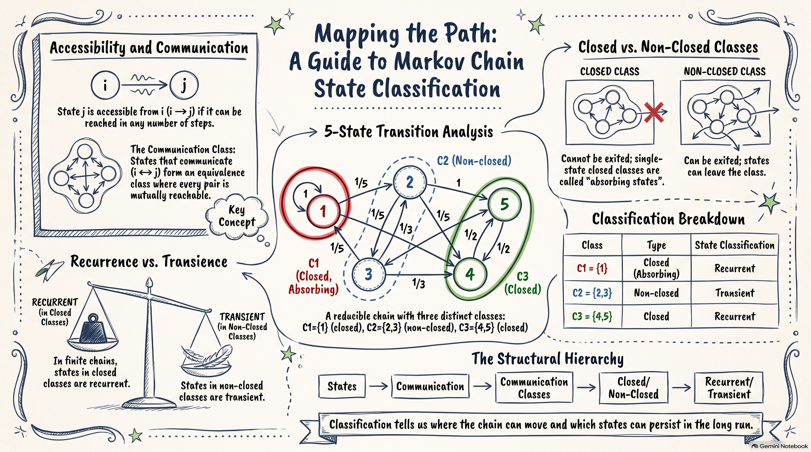
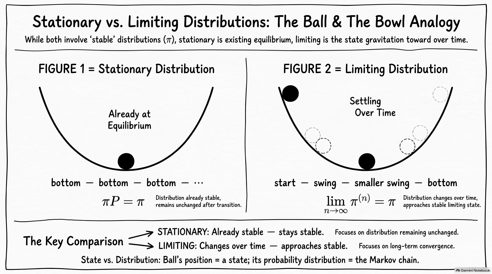

# Classification of States

## Classification of States

So far, we have studied how a Markov chain moves between states and how to calculate $n$-step transition probabilities.

We now ask:

> **What does the structure of the chain tell us about its long-run behaviour?**

A Markov chain may contain groups of states that the process can leave, and groups that it cannot leave once entered.

For example, a chain may eventually enter either ${1}$ or ${4,5}$ and then remain there.

To analyse this structure, we study:

* **accessibility and communication**; **communication classes**;
* **closed and non-closed classes**; **transient and recurrent states**.

Throughout, $\{X_n\}_{n\geq 0}$ is a time-homogeneous Markov chain with state space $S$ and transition matrix $P=(p_{ij})$.

## Applications in Insurance

State classification is useful when a Markov chain models the evolution of an insurance system.

* **NCD system:** determine whether different premium levels communicate and whether there is a single long-run class.
* **Health insurance:** identify transient health states and closed states such as death.
* **Claims or risk models:** distinguish temporary conditions from long-term regimes.

The classification helps answer:

* Which states can the process eventually reach?
* Which states can be revisited indefinitely?
* Which states can be left permanently?
* Does the process eventually enter a particular closed class?

These questions lead naturally to **absorption probabilities** and **long-run behaviour**.

## Accessibility and Communication

For $i,j\in S$, state $j$ is **accessible** from state $i$, written $i\rightarrow j$, if

$$
p_{ij}^{(n)}>0
$$

for some $n\geq0$.

Thus, starting from $i$, there is a positive probability of reaching $j$ after some number of transitions.

Accessibility does **not** require a one-step transition.

If there are states $k_1,\ldots,k_r$ such that

$$
p_{ik_1}p_{k_1k_2}\cdots p_{k_rj}>0,
$$

then $i\rightarrow j$.

## Communication

States $i$ and $j$ **communicate**, written $i\leftrightarrow j$, if each is accessible from the other:

$$
i\rightarrow j
\quad\text{and}\quad
j\rightarrow i.
$$

Communication is an **equivalence relation**, so it partitions $S$ into **communication classes**.

Within a communication class, every pair of states communicates.

## Closed Classes

A communication class $C$ is **closed** if, once the chain enters $C$, it cannot move to a state outside $C$.

Equivalently,

$$
p_{ij}=0
\qquad\text{for all }i\in C,\ j\notin C.
$$

A class that is not closed is called a **non-closed class**.

## Absorbing States

A closed class containing a single state is an **absorbing state**.

State $i$ is absorbing if

$$
p_{ii}=1.
$$

Thus, once the chain enters an absorbing state, it remains there forever.

## Reducibility

If the entire state space consists of one communication class, the chain is **irreducible**.

Otherwise, it is **reducible**.

Hence,

$$
\boxed{\text{one communication class}\iff\text{irreducible}.}
$$

## Irreducible Markov Chains

A Markov chain is **irreducible** if every state can be reached from every other state.

Equivalently, the entire state space is a single communication class.

Thus, for every $i,j\in S$,

$$
i\leftrightarrow j.
$$

If $S$ contains more than one communication class, the Markov chain is **reducible**.

## Why Is Irreducibility Important?

Irreducibility means that no state or group of states is permanently separated from the others.

For a finite irreducible Markov chain:

* there is a **unique stationary distribution**;
* every state is **revisited repeatedly** in the long run.

Thus, the long-run behaviour of the entire chain can be studied through a single stationary distribution.

## Transient and Recurrent States

A state is **recurrent** if, starting from that state, the chain returns to it with probability $1$.

A state is **transient** if there is a positive probability that the chain never returns to it.

For a **finite** Markov chain:

$$
\boxed{
\begin{array}{c}
\text{closed communication class}\\
\Downarrow\\
\text{recurrent states}
\end{array}
}
\qquad
\boxed{
\begin{array}{c}
\text{non-closed communication class}\\
\Downarrow\\
\text{transient states}
\end{array}
}
$$

A non-closed class can eventually be left; a closed class cannot.

## Mathematical Definition

Given $X_0=i$, define the first return time

$$
T_i=\min\{n\geq1:X_n=i\}.
$$

State $i$ is **recurrent** if

$$
\Pr(T_i<\infty\mid X_0=i)=1.
$$

It is **transient** if

$$
\Pr(T_i<\infty\mid X_0=i)<1.
$$

Thus, recurrence means return with probability $1$, while transience means there is a positive probability of never returning.

## Key Idea

The communication structure tells us what can happen in the long run.

| Structure            | Interpretation                          |
| -------------------- | --------------------------------------- |
| $i\rightarrow j$     | $j$ is accessible from $i$              |
| $i\leftrightarrow j$ | $i$ and $j$ communicate                 |
| Closed class         | Cannot be left once entered             |
| Non-closed class     | Can be left                             |
| Recurrent state      | Returned to with probability $1$        |
| Transient state      | Positive probability of never returning |

For a **finite** Markov chain:

$$
\boxed{
\text{closed class}\Rightarrow\text{recurrent},
\qquad
\text{non-closed class}\Rightarrow\text{transient}.
}
$$

## Example: Five-State Classification

Consider a Markov chain with state space $S={1,2,3,4,5}$ and transition matrix

$$
P=
\begin{bmatrix}
1&0&0&0&0\\
1/5&1/5&1/5&1/5&1/5\\
1/3&1/3&0&1/3&0\\
0&0&0&0&1\\
0&0&0&1/2&1/2
\end{bmatrix}.
$$

Identify the communication classes, determine which are closed, classify the states, and determine whether the chain is irreducible.

## Five-State Classification

The communication classes are

$$
C_1=\{1\},\qquad
C_2=\{2,3\},\qquad
C_3=\{4,5\}.
$$

$C_1$ is closed because $p_{11}=1$.

$C_3$ is closed because states $4$ and $5$ communicate and neither can leave ${4,5}$.

$C_2$ is non-closed because states $2$ and $3$ communicate, but the chain can leave the class; for example,

$$
p_{21}>0,\qquad p_{24}>0.
$$

Therefore, $\boxed{{1},{4,5}\text{ are closed classes; }{2,3}\text{ is a non-closed class}.}$

## Five-State Classification

Since the chain is finite:

$$
\boxed{1,4,5\text{ are recurrent}}
$$

and

$$
\boxed{2,3\text{ are transient}.}
$$

The chain has three communication classes, so it is **reducible**.

The structure can be summarised as

$$
\{2,3\}
\longrightarrow
\{1\}
\qquad\text{or}\qquad
\{4,5\},
$$

where ${1}$ and ${4,5}$ are closed classes.

## State Classification Roadmap

{width=75% fig-align="center"}

---

## Example: Communication Classes: Applications

Consider the following three Markov chains:

1. an NCD system;
2. a health insurance system;
3. a simple random walk with absorbing boundaries.

For each chain, identify the communication classes and determine whether it is irreducible.

Use the transition diagram and transition probabilities to justify your answers.

## NCD System

Suppose the states are $\{0,1,2\}$.

Every pair of states communicates. For example,
$0\rightarrow1$ and $1\rightarrow0$ because $p_{01}>0$ and $p_{10}>0$.

Similarly, $1\rightarrow2$ and $2\rightarrow1$.

Hence, all states belong to one communication class:
$$
\boxed{C=\{0,1,2\}}.
$$

## NCD System

Since $C$ is the entire state space, no transition can leave the class. Thus, $C$ is closed.

Therefore, the Markov chain is irreducible:
$$
\boxed{\text{The NCD Markov chain is irreducible.}}
$$

## Health Insurance System

The communication classes are
$$
O=\{H,S\},\qquad C=\{D\}.
$$

The states $H$ and $S$ communicate because
$p_{HS}>0$ and $p_{SH}>0$.

Thus,
$$
\boxed{O=\{H,S\}\text{ is a communication class}.}
$$

## Health Insurance System

The class $O$ is non-closed because $p_{HD}>0$.

The class $C=\{D\}$ is closed because $p_{DD}=1$.
Thus, $D$ is an absorbing state.

Therefore,
$$
\boxed{\{H,S\}\text{ is non-closed},\qquad
\{D\}\text{ is closed}.}
$$

Hence, the chain is
$$
\boxed{\text{reducible}.}
$$
## Random Walk with Absorbing Boundaries

For a simple random walk on $\{0,1,\ldots,N\}$ with absorbing boundaries, the communication classes are
$$
\boxed{\{1,2,\ldots,N-1\},\qquad \{0\},\qquad \{N\}.}
$$

The interior class is non-closed because the chain can move to either boundary.

## Random Walk with Absorbing Boundaries

The classes $\{0\}$ and $\{N\}$ are closed because $0$ and $N$ are absorbing states.

Hence,
$$
\boxed{\{1,\ldots,N-1\}\text{ is non-closed},\qquad
\{0\},\{N\}\text{ are closed}.}
$$

Therefore, the chain is
$$
\boxed{\text{reducible}.}
$$

# Absorption Probabilities in a General Markov Chain

## From Random Walks to General Markov Chains

For a random walk with absorbing barriers, we calculated the probability of eventually reaching each absorbing state.

We now extend this idea to a **general finite Markov chain**, where there may be several closed communication classes.

Let $C$ be a closed communication class. Define

$$
u_i^C=\Pr(\text{eventually enter }C\mid X_0=i).
$$

Thus, $u_i^C$ is the probability that $C$ is the eventual closed-class destination when the chain starts from $i$.

## Boundary Conditions

If $i\in C$, the chain is already in $C$ and cannot leave:

$$
u_i^C=1.
$$

If $i$ belongs to another closed class $C'\neq C$, the chain cannot move from $C'$ to $C$:

$$
u_i^C=0.
$$

For a transient state $i$, condition on the state after the first transition:

$$
u_i^C=\sum_{j\in S}p_{ij}u_j^C.
$$

This is the same **first-step analysis** used for the random walk.

## Matrix Formulation

Let $\mathbf{u}^C=(u_1^C,\ldots,u_m^C)^\mathsf{T}$, where $m=|S|$.

The first-step equations can be written as

$$
\boxed{\mathbf{u}^C=P\mathbf{u}^C}
$$

with boundary conditions

$$
u_i^C=
\begin{cases}
1, & i\in C,\\
0, & i\in C',\ C'\neq C,
\end{cases}
$$

for states belonging to closed classes.

The remaining equations determine the absorption probabilities for transient states.

## Example: Five-State Markov Chain

Consider the five-state chain from the previous section:

$$
P=
\begin{bmatrix}
1&0&0&0&0\\
1/5&1/5&1/5&1/5&1/5\\
1/3&1/3&0&1/3&0\\
0&0&0&0&1\\
0&0&0&1/2&1/2
\end{bmatrix}.
$$

The closed classes are

$$
C_1=\{1\},
\qquad
C_3=\{4,5\}.
$$

Find the probability that the chain eventually enters $C_3$, given $X_0=2$.

## Five-State Markov Chain

Define
$$
u_i=\Pr(\text{eventually enter }\{4,5\}\mid X_0=i).
$$

Since $\{4,5\}$ is closed,
$$
u_4=u_5=1.
$$

Since $\{1\}$ is another closed class,
$$
u_1=0.
$$

For states $2$ and $3$, first-step analysis gives
$$
u_2=\frac15u_2+\frac15u_3+\frac25,
\qquad
u_3=\frac13u_2+\frac13.
$$

## Five-State Markov Chain

Solving the two equations gives
$$
\boxed{u_2=\frac7{11}},
\qquad
\boxed{u_3=\frac6{11}}.
$$

Therefore,
$$
\boxed{
\Pr(\text{eventually enter }\{4,5\}\mid X_0=2)=\frac7{11}.
}
$$

Starting from state $2$, the only two possible closed-class destinations are $\{1\}$ and $\{4,5\}$. Hence,
$$
\Pr(\text{eventually enter }\{1\}\mid X_0=2)
=1-\frac7{11}
=\frac4{11}.
$$

Thus,
$$
\boxed{\frac4{11}+\frac7{11}=1.}
$$

## Five-State Markov Chain

Similarly, starting from state $3$,
$$
\boxed{
\Pr(\text{eventually enter }\{4,5\}\mid X_0=3)=\frac6{11}
}
$$

and
$$
\boxed{
\Pr(\text{eventually enter }\{1\}\mid X_0=3)=\frac5{11}.
}
$$

## Multiple Closed Classes

Suppose a finite Markov chain has closed classes
$$
C_1,C_2,\ldots,C_r.
$$

For each $C_k$, define
$$
u_i^{(k)}
=
\Pr(\text{eventually enter }C_k\mid X_0=i).
$$

For $i\in C_k$,
$$
u_i^{(k)}=1.
$$

## Multiple Closed Classes

For $i\in C_\ell$, $\ell\neq k$,
$$
u_i^{(k)}=0.
$$

For a transient state $i$, first-step analysis gives
$$
u_i^{(k)}
=
\sum_{j\in S}p_{ij}u_j^{(k)}.
$$

Thus, the probability of eventually entering each closed class can be found by solving these equations with the appropriate boundary conditions.

## Multiple Closed Classes

Since a finite Markov chain eventually enters one of its closed classes with probability $1$,

$$
\boxed{
\sum_{k=1}^r u_i^{(k)}=1
}
$$

for every state $i$.

Thus, the values $u_i^{(1)},\ldots,u_i^{(r)}$ give the probabilities of all possible long-run destinations.

For the five-state example,

$$
u_2^{(1)}=\frac4{11},
\qquad
u_2^{(3)}=\frac7{11}.
$$

Therefore, starting from state $2$, the chain eventually enters ${1}$ with probability $\frac4{11}$ and ${4,5}$ with probability $\frac7{11}$.

## Key Idea

The **closed communication classes** are the possible long-run destinations of a finite Markov chain.

The absorption probability

$$
u_i^{(k)}
=
\Pr(\text{eventually enter }C_k\mid X_0=i)
$$

gives the probability of each destination.

Thus,

$$
\boxed{
\text{classification identifies the destinations;}
\quad
\text{first-step analysis calculates their probabilities.}
}
$$

## From Absorption to Long-Run Behaviour

Absorption probabilities tell us **which closed class the chain eventually enters**.

Once inside a closed class, however, the chain can continue to move between its states.

We therefore ask:

> **What does the chain do in the long run after it enters a closed class?**

This leads to the study of **stationary distributions** and **limiting probabilities**.

# Long-Run Behaviour of Markov Chains

## From State Classification to Long-Run Behaviour

For a finite Markov chain, the chain eventually enters a closed communication class with probability $1$.

Once inside, it cannot leave but can continue moving between states.

We therefore ask:

> **What happens to the distribution of the chain as $n\rightarrow\infty$?**

We will study:

* **stationary distributions** — distributions unchanged by each transition;
* **limiting distributions** — distributions approached as $n\rightarrow\infty$;
* **periodicity** — a structural property that can prevent convergence.

A stationary distribution describes **equilibrium**, whereas a limiting distribution describes **what the chain approaches over time**.

## Stationary vs. Limiting Distributions

{width=75% fig-align="center"}

## Within a Closed Communicating Class

Suppose $C$ is a closed communicating class.

$$
\text{enter }C
\quad\longrightarrow\quad
\text{remain in }C
\quad\longrightarrow\quad
\text{continue moving within }C
$$

Once the chain enters $C$, it cannot leave. The chain therefore continues to move among the states in $C$.

## Within a Closed Communicating Class

For a finite closed communicating class, there is a unique stationary probability distribution
$$
\boldsymbol{\pi}=(\pi_i)_{i\in C}
$$
satisfying
$$
\boldsymbol{\pi}P_C=\boldsymbol{\pi},
\qquad
\pi_i\geq0,
\qquad
\sum_{i\in C}\pi_i=1.
$$

Here, $P_C$ is the transition matrix restricted to the states in $C$.

## Within a Closed Communicating Class

If the chain starts with distribution $\boldsymbol{\pi}$, then
$$
\boldsymbol{\pi}P_C^n=\boldsymbol{\pi},
\qquad n\geq1.
$$

Thus, $\boldsymbol{\pi}$ describes an **equilibrium distribution within the closed class**.

It gives the long-run proportions associated with the states in $C$, provided the chain is aperiodic.

## Stationary Distributions

Consider a Markov chain with transition matrix $P$ and state space $S$.

A probability distribution $\boldsymbol{\pi}=(\pi_i)_{i\in S}$ is **stationary** if

$$
\boxed{\boldsymbol{\pi}P=\boldsymbol{\pi}.}
$$

Equivalently, for each $j\in S$,

$$
\pi_j=\sum_{i\in S}\pi_i p_{ij}.
$$

The components satisfy

$$
\pi_i\geq0,
\qquad
\sum_{i\in S}\pi_i=1.
$$

## Stationary Distributions

The equation $\boldsymbol{\pi}P=\boldsymbol{\pi}$ means that the distribution is unchanged after one transition.

Consequently,

$$
\boxed{\boldsymbol{\pi}P^n=\boldsymbol{\pi},\qquad n\geq1.}
$$

For a finite irreducible Markov chain, the stationary distribution exists and is unique.

## Example: Finding a Stationary Distribution

Consider

$$
P=
\begin{bmatrix}
1-a&a\\
b&1-b
\end{bmatrix},
\qquad 0<a,b<1.
$$

Let $\boldsymbol{\pi}=(\pi_0,\pi_1)$.

From $\boldsymbol{\pi}P=\boldsymbol{\pi}$,

$$
\pi_0(1-a)+\pi_1b=\pi_0
\quad\Longrightarrow\quad
a\pi_0=b\pi_1.
$$

## Example: Finding a Stationary Distribution

Together with $\pi_0+\pi_1=1$,

$$
\boxed{
\pi_0=\frac{b}{a+b},
\qquad
\pi_1=\frac{a}{a+b}.
}
$$

Hence,

$$
\boxed{
\boldsymbol{\pi}
=
\left(
\frac{b}{a+b},
\frac{a}{a+b}
\right).
}
$$

For $a=0.2$ and $b=0.4$,

$$
\boxed{\boldsymbol{\pi}=\left(\frac23,\frac13\right).}
$$

## Stationary Distribution: Interpretation

A stationary distribution is an **equilibrium distribution**.

If

$$
\boldsymbol{\pi}=(2/3,1/3),
$$

then a chain starting with this distribution remains distributed as $(2/3,1/3)$ after every transition.

It does **not** mean that an individual chain remains in one state.

## Stationary Distribution: Interpretation

The individual chain continues to move:

$$
0\longrightarrow1\longrightarrow0\longrightarrow0\longrightarrow1\longrightarrow\cdots
$$

while the **distribution across many chains** remains unchanged.

This distinction is important when interpreting stationary distributions in applications such as NCD systems.

## Limiting Distributions

A **limiting distribution** describes the distribution approached by the chain after a large number of transitions.

For $i,j\in S$, suppose

$$
\boxed{
\lim_{n\rightarrow\infty}p_{ij}^{(n)}=\pi_j.
}
$$

The limit depends on the destination state $j$, but not on the initial state $i$.

Thus, for large $n$, the probability of being in state $j$ is approximately $\pi_j$, regardless of where the chain started.

## Limiting Behaviour of $P^n$

Recall that

$$
P^n=
\begin{bmatrix}
p_{11}^{(n)}&p_{12}^{(n)}&\cdots\\
p_{21}^{(n)}&p_{22}^{(n)}&\cdots\\
\vdots&\vdots&\ddots
\end{bmatrix}.
$$

If $p_{ij}^{(n)}\longrightarrow\pi_j$ for every $i,j$, then every row of $P^n$ approaches the same distribution:

$$
\boxed{
P^n
\longrightarrow
\begin{bmatrix}
\boldsymbol{\pi}\\
\boldsymbol{\pi}\\
\vdots\\
\boldsymbol{\pi}
\end{bmatrix}.
}
$$

## Limiting Behaviour of $P^n$

Equivalently,

$$
\boxed{
P^n\longrightarrow\boldsymbol{1}\boldsymbol{\pi}.
}
$$

Hence, for large $n$, the distribution of the chain becomes independent of its initial state.

## Initial Distribution

Suppose the initial distribution is

$$
\boldsymbol{\pi}^{(0)}
=
\left(\Pr(X_0=i)\right)_{i\in S}.
$$

After $n$ transitions,

$$
\boxed{
\boldsymbol{\pi}^{(n)}
=
\boldsymbol{\pi}^{(0)}P^n.
}
$$

If

$$
P^n\longrightarrow\boldsymbol{1}\boldsymbol{\pi},
$$

then

$$
\begin{aligned}
\boldsymbol{\pi}^{(n)}
&\longrightarrow
\boldsymbol{\pi}^{(0)}
\boldsymbol{1}\boldsymbol{\pi}\\
&=\boldsymbol{\pi},
\end{aligned}
$$

because $\boldsymbol{\pi}^{(0)}\boldsymbol{1}=1$.

## Initial Distribution

Thus,

$$
\boxed{
\boldsymbol{\pi}^{(n)}
\longrightarrow\boldsymbol{\pi}.
}
$$

The limiting distribution is independent of the initial distribution.

## Stationary vs. Limiting Distributions

The two concepts answer different questions.

|                | Stationary distribution              | Limiting distribution                       |
| -------------- | ------------------------------------ | ------------------------------------------- |
| Question       | Is the distribution unchanged?       | What distribution is approached?            |
| Condition      | $\boldsymbol{\pi}P=\boldsymbol{\pi}$ | $\boldsymbol{\pi}^{(n)}\to\boldsymbol{\pi}$ |
| Interpretation | Equilibrium                          | Long-run distribution                       |

If a limiting distribution exists, it must be stationary:

$$
\boxed{
\text{limiting distribution}
\Longrightarrow
\text{stationary distribution}.
}
$$

## Stationary vs. Limiting Distributions

However,

$$
\boxed{
\text{stationary distribution}
\not\Longrightarrow
\text{limiting distribution}.
}
$$

Periodicity can prevent convergence.

## Example: A Stationary but Non-Limiting Distribution

Consider

$$
P=
\begin{bmatrix}
0&1\\
1&0
\end{bmatrix}.
$$

The stationary distribution is

$$
\boldsymbol{\pi}
=
\left(\frac12,\frac12\right).
$$

However, if $X_0=0$,

$$
\boldsymbol{\pi}^{(0)}=(1,0),
$$

and the distributions alternate:

$$
(1,0),\quad
(0,1),\quad
(1,0),\quad
(0,1),\quad\ldots
$$

## Example: A Stationary but Non-Limiting Distribution

Therefore, $\boldsymbol{\pi}^{(n)}$ does not converge.

The chain is **periodic**, with period $2$.

## Conditions for Convergence

For a finite irreducible Markov chain:

* a stationary distribution exists and is unique;
* **aperiodicity** is required for convergence to that distribution.

If the chain is finite, irreducible, and aperiodic, then

$$
\boxed{
p_{ij}^{(n)}
\longrightarrow
\pi_j
\qquad\text{for all }i,j.
}
$$

## Conditions for Convergence

Equivalently, for any initial distribution,

$$
\boxed{
\boldsymbol{\pi}^{(0)}P^n
\longrightarrow
\boldsymbol{\pi}.
}
$$

Thus,

$$
\boxed{
\text{finite}
+\text{ irreducible}
+\text{ aperiodic}
\Longrightarrow
\text{convergence to a unique stationary distribution}.
}
$$

## Periodicity

A state $i$ has **period**

$$
d(i)
=
\gcd\{n\geq1:p_{ii}^{(n)}>0\}.
$$

If

$$
d(i)=1,
$$

then state $i$ is **aperiodic**.

For an irreducible chain, all states have the same period, so the chain itself can be described as periodic or aperiodic.

## Periodicity

The key question is:

> **Do the possible return times have a common divisor greater than $1$?**

## Example: Aperiodicity in an NCD System

Consider the four-state NCD system

$$
P=
\begin{bmatrix}
0.80&0.20&0&0\\
0.10&0.80&0.10&0\\
0&0.10&0.80&0.10\\
0&0&0.20&0.80
\end{bmatrix}.
$$

The chain is irreducible because every state can be reached from every other state.

Also,

$$
p_{ii}>0
\qquad\text{for every }i.
$$

## Example: Aperiodicity in an NCD System

For example,

$$
p_{22}=0.80>0.
$$

Therefore, a return after one transition is possible:

$$
p_{22}^{(1)}>0.
$$

Hence,

$$
d(2)=1.
$$

Since the chain is irreducible, all states are aperiodic.

Thus, the NCD system is

$$
\boxed{\text{irreducible and aperiodic}.}
$$

## Checking Aperiodicity

There are several useful ways to identify aperiodicity.

**Self-loop:** If

$$
p_{ii}>0,
$$

then $p_{ii}^{(1)}>0$, so

$$
d(i)=1.
$$

## Checking Aperiodicity

**Two return times:** If

$$
p_{ii}^{(m)}>0,\qquad
p_{ii}^{(n)}>0,
\qquad
\gcd(m,n)=1,
$$

then

$$
d(i)=1.
$$

For an irreducible chain, if one state is aperiodic, then every state is aperiodic.

## Example: Two Return Times with GCD $1$

Suppose returns to state $2$ are possible after $2$ and $3$ transitions:

$$
p_{22}^{(2)}>0,
\qquad
p_{22}^{(3)}>0.
$$

Then

$$
d(2)
=
\gcd\{n\geq1:p_{22}^{(n)}>0\}
\leq
\gcd(2,3)=1.
$$

Therefore,

$$
\boxed{d(2)=1,}
$$

so state $2$ is aperiodic.

A self-loop is **not necessary** for aperiodicity.

## Example: Period $2$

Consider

$$
P=
\begin{bmatrix}
0&1/2&0&1/2\\
1/4&0&3/4&0\\
0&1/3&0&2/3\\
1/2&0&1/2&0
\end{bmatrix}.
$$

The states split into two groups:

$$
\{1,3\}
\qquad\text{and}\qquad
\{2,4\}.
$$

## Example: Period $2$

Every transition moves between the two groups:

$$
\{1,3\}
\longrightarrow
\{2,4\}
\longrightarrow
\{1,3\}
\longrightarrow\cdots
$$

Therefore, a return to the original state is possible only after an even number of transitions.

Hence,

$$
p_{ii}^{(2n)}>0,
\qquad
p_{ii}^{(2n+1)}=0,
$$

and

$$
\boxed{d(i)=2.}
$$

The chain is periodic.

## Why Aperiodicity Matters

A periodic chain can continue to visit every state indefinitely while its probabilities oscillate.

For example,

$$
P=
\begin{bmatrix}
0&1\\
1&0
\end{bmatrix}
$$

has stationary distribution

$$
\left(\frac12,\frac12\right),
$$

but its distribution alternates between

$$
(1,0)
\quad\text{and}\quad
(0,1).
$$

## Why Aperiodicity Matters

Aperiodicity removes this persistent oscillation.

Thus, for a finite irreducible aperiodic chain,

$$
\boxed{
p_{ij}^{(n)}
\longrightarrow
\pi_j.
}
$$

## Example: Convergence to a Limiting Distribution

Consider

$$
P=
\begin{bmatrix}
1/3&2/3\\
2/3&1/3
\end{bmatrix}.
$$

The chain is irreducible and aperiodic because

$$
p_{01}>0,\qquad p_{00}>0.
$$

Its stationary distribution is

$$
\boldsymbol{\pi}
=
\left(\frac12,\frac12\right).
$$

## Example: Convergence to a Limiting Distribution

Starting from state $0$,
$$
\boldsymbol{\pi}^{(0)}=(1,0).
$$

After one transition,
$$
\boldsymbol{\pi}^{(1)}
=
\left(\frac13,\frac23\right),
$$

and after two transitions,
$$
\boldsymbol{\pi}^{(2)}
=
\left(\frac59,\frac49\right).
$$

## Example: Convergence to a Limiting Distribution

As $n$ increases,
$$
\boxed{
\boldsymbol{\pi}^{(n)}
\longrightarrow
\left(\frac12,\frac12\right).
}
$$

The same limiting distribution is obtained from any initial distribution.

## Long-Run Behaviour: Summary

For a finite Markov chain:

$$
\boxed{
\begin{array}{c}
\text{irreducible}\\
+\ \text{aperiodic}
\end{array}
}
\quad\Longrightarrow\quad
\boxed{
\begin{array}{c}
\text{unique stationary distribution}\\
\boldsymbol{\pi}P=\boldsymbol{\pi}\\[2pt]
\text{limiting distribution}\\
\boldsymbol{\pi}^{(0)}P^n\to\boldsymbol{\pi}
\end{array}
}
$$

## Long-Run Behaviour: Summary

The roles of the conditions are:

* **irreducibility:** all states communicate;
* **aperiodicity:** prevents persistent oscillation;
* **finiteness:** ensures the stationary distribution exists for an irreducible chain.

Thus, the stationary distribution describes **equilibrium**, while the limiting distribution describes **convergence to equilibrium**.

## Application: Long-Run Behaviour of an NCD System

Consider an NCD system with three levels:

| Level    |    1 |     2 |     3 |
| -------- | ---: | ----: | ----: |
| Discount | $0%$ | $30%$ | $50%$ |

Suppose:

* no claim $\rightarrow$ move one level higher, or remain at level 3;
* one claim $\rightarrow$ move one level lower, or remain at level 1;
* two or more claims $\rightarrow$ move to level 1.

## Application: Long-Run Behaviour of an NCD System

For $N\sim\operatorname{Poisson}(\lambda)$, define

$$
q_0=\Pr(N=0),\qquad
q_1=\Pr(N=1),\qquad
q_2=\Pr(N\geq2).
$$

Then

$$
q_0=e^{-\lambda},
\qquad
q_1=\lambda e^{-\lambda},
\qquad
q_2=1-q_0-q_1.
$$

The transition matrix is

$$
\boxed{
P=
\begin{bmatrix}
q_1+q_2&q_0&0\\
1-q_0&0&q_0\\
q_2&q_1&q_0
\end{bmatrix}.
}
$$

## Application: Long-Run NCD Distribution

Let

$$
\boldsymbol{\pi}
=
(\pi_1,\pi_2,\pi_3)
$$

be the stationary distribution.

It satisfies

$$
\boldsymbol{\pi}P=\boldsymbol{\pi},
\qquad
\pi_1+\pi_2+\pi_3=1.
$$

For a portfolio of 5,000 policyholders, the long-run expected numbers at the three levels are

$$
\boxed{
(5000\pi_1,\;5000\pi_2,\;5000\pi_3).
}
$$

## Application: Long-Run NCD Distribution

If the full premium is $B$, the long-run expected premium per driver is

$$
\boxed{
B(\pi_1+0.70\pi_2+0.50\pi_3).
}
$$

Thus, the stationary distribution connects the Markov-chain model directly to the long-run composition and premium income of the insurance portfolio.

## Long-Run Behaviour with Several Closed Classes

If a finite chain has several closed communication classes, there need not be a single limiting distribution independent of the initial state.

The chain first enters one of the closed classes, with probabilities determined by the **absorption probabilities** studied earlier.

## Long-Run Behaviour with Several Closed Classes

Once inside a closed class, its long-run behaviour is determined by the stationary distribution of that class.

Thus,

$$
\boxed{
\text{absorption probabilities}
\quad+\quad
\text{within-class stationary distributions}
}
$$

determine the long-run behaviour of a reducible finite Markov chain.